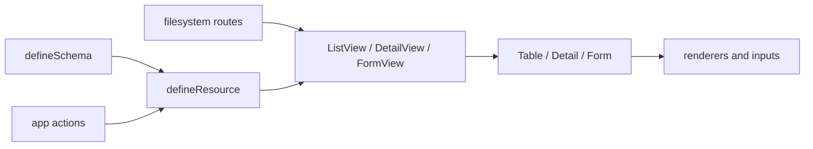
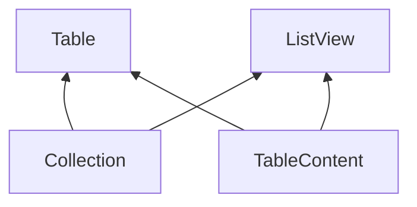

# Web Application Architecture

- **Status:** Shipped
- **Scope:** `apps/web` and reusable APIs in `packages/loom`
- **Last updated:** 2026-08-11

This document describes the current frontend resource API. The locked decision
record is [Frontend Resource and Schema Architecture](../superpowers/specs/2026-08-11-frontend-resource-schema-architecture-design.md).

## Principles

1. Routes own URLs, navigation, dialogs, confirmations, toasts, and workflows.
2. Schemas own the standard web data contract and validation.
3. Resources own standard application actions and return native View props.
4. Core components own data presentation and editing. They do not know routes,
   transport, or application permissions.
5. Each module binds one schema-bound field set and each standard action selects
   its ordered references.
6. Custom actions are declared actions with an explicit client permission contract.
7. The backend remains the authority for access and validation.

## Route ownership

Filesystem routes define the page structure and route names. A list, detail,
create form, update form, or nested page gets its own route when it is an
independent screen. Follow the [file-routing convention](file-routing.md) for
retained parents, replacement pages, tabs, and Back behavior.

```text
settings/roles/
  index.route.vue
  create.route.vue
  [roleId]/detail.route.vue
  [roleId]/edit.route.vue
  [roleId]/detail/permissions/index.route.vue
```

The parent route supplies layout and tab data. The child route owns its action,
query state, data loading, and user workflow.

## Layers



The framework core has no Hono or application transport dependency. The app
owns transport adapters, response normalization, and service functions.

## Unified schema

Loom owns generic resource contracts and `defineResource`. Carta web owns the
app schema builder at `@/framework/schema`. Hono types stay in Carta web.
The builder accepts raw Zod schemas and converts them through Loom's `fromZod`
bridge.

```ts
import { defineSchema } from '@/framework/schema'

export const usersSchema = defineSchema(rpc.users, {
  identity: 'id',
  record: user.schemas.select,
  create: createUserFormSchema,
  update: user.schemas.update,
  validators: { create: createValidators, update: updateValidators },
})
```

The route requires a record schema. It requires create and update schemas only
when those route operations exist. A supplied query schema must match the route
query type. The create and update checks use parsed Zod output, which is the
value sent by a form. Required raw form keys must still be wire keys.

For a resource without a standard Hono route, use an explicit Loom contract:

```ts
type AuditLogContract = WebResourceSchema<AuditLog, AuditLogQuery, AuditLogCreate, AuditLogUpdate, string>

export const auditLogsSchema = defineSchema<AuditLogContract>({
  identity: 'id',
  record: auditLogRecordSchema,
  query: auditLogQuerySchema,
  create: auditLogCreateSchema,
  update: auditLogUpdateSchema,
})
```

Local runtime schemas can also infer a custom contract. If a form control has a
different raw shape, keep its transform in the local form schema. A raw form
type is optional and local to a function that consumes it.

The schema owns record, query, create, and update validation. It can also own
transforms and synchronous or asynchronous standard validators. Custom action
inputs are not added to the schema.

## Per-action resources

The resource receives the schema value and one `actions` object. Standard action
blocks keep the run function, fields, access metadata, route, and View options
together.

```ts
import { defineFields, defineResource } from '@southneuhof/loom'

const api = createHonoResourceActions(rpc.users)
const fields = defineFields(usersSchema, {
  name: { label: 'Name', form: { renderer: 'text' } },
  email: { label: 'Email', form: { renderer: 'text', props: { type: 'email' } } },
  statusCode: { label: 'Status', form: { renderer: 'radio' } },
})

export const users = defineResource(usersSchema, {
  key: 'users',
  actions: {
    list: {
      run: api.list,
      fields: [fields.name, fields.email, fields.statusCode],
      permission: 'view-users',
      route: { name: 'settings-users' },
    },
    detail: {
      run: api.detail,
      fields: [fields.name, fields.email, fields.statusCode],
      permission: 'view-users',
      route: {
        name: 'settings-users-detail',
        params: (id) => ({ userId: id }),
      },
    },
    create: {
      run: api.create,
      fields: [fields.name, fields.email],
      permission: 'create-users',
      route: { name: 'settings-users-create' },
    },
    update: {
      run: api.update,
      fields: [fields.name, fields.statusCode],
      permission: 'update-users',
      route: {
        name: 'settings-users-edit',
        params: (id) => ({ userId: id }),
      },
    },
    delete: { run: api.delete, permission: 'delete-users' },
    verify: { run: verifyUser, permission: 'verify-users' },
  },
})
```

The standard action names are `list`, `detail`, `create`, `update`, and
`delete`. The first four return typed View props. Delete returns a typed action
with a `run` function. Every other action name is a custom action and declares
exactly `{ run, permission }`. The permission is a nonempty string, a nonempty
readonly string array (all entries required), a synchronous resolver over the
exact `run` argument tuple that returns one of those values, or `null` for an
intentionally open action. A custom action exposes `{ can(...), run(...) }`
with the exact `run` argument tuple. `can` checks the resolved permission
through the access adapter with the custom action name as the operation.
`run` calls the same check and throws before application code when access is
denied. The framework does not add transport rules, validation, or automatic
invalidation to a custom action.

Each standard action can select a schema-bound field reference or a typed schema
key string. List and detail keys come from the record shape. Create keys come
from the create input. Update keys come from the update input. String
selections resolve to the minimal `{ key }` field and still receive app field
defaults. References remain schema-bound and keep resource-specific metadata.
Unknown keys fail at compile time. Foreign references and duplicate mixed
selections fail at runtime.

Targetless action visibility (a list Create button, row Edit links) is driven
by each declared action `permission` through the browser effective permission
set that `/me` returns. Record actions stay server-derived: the browser may
hide a control, and the API repeats the check on submit.

Standard create and update actions compose the existing field `context`: caller
keys remain available, then the framework writes the reserved keys
`operation` (`create` or `update`) and `permission` (the declared action
permission or `null`). Caller values cannot override the reserved keys. Field
behavior reads `context.permission` to scope relation lookups to the operation;
a missing permission in a lookup behavior is a contract error, not a fallback.

Resource action `permission` is the admin route guard (`view-*`). A lookup
`source` is another resource's `list` / `detail`. The API gates those calls
with `list-*` / `detail-*`.

## Field references

`defineFields(schema, definitions)` keeps shared labels and surface projections
adjacent to the schema. Surface settings use `display`, `table`, `detail`, and
`form` projections. Actions select immutable references in the required order.

```ts
const roleFields = defineFields(rolesSchema, {
  name: { label: 'Role name', form: { renderer: 'text' } },
  description: { label: 'Description', form: { renderer: 'textarea' } },
})

const createFields = [roleFields.name, roleFields.description]
const updateFields = [
  roleFields.name,
  roleFields.description,
]
```

The override is one terminal partial patch. Its result has no second override
method. Omission removes a field from a View, and array order is the View order.

The field value contract is explicit. `display.read` supplies a display value;
when it is absent, the framework reads `record[field.key]`. The reactive form
draft stores control values, and loaded values use input hydration. The
renderer input contract supplies default non-empty control-shape validation.
`form.validate` replaces that default. `form.write` is the only submit writer;
when it is absent, the copied field value stays unchanged. It runs on a
shallow submit copy before schema validation. Schema validation owns
requiredness and the final submitted shape. Action-level business validators
run last. A form-only `form.initialValue` factory supplies a fresh value only
when the incoming model or initial data does not own the key. Explicit and
loaded values win, including `false`, `null`, and an empty string. There are no
top-level field `read` or `write` members and callers do not add identity
functions.

Multi lookup and select fields use one contract. The schema is
`selectionValues(exactItemSchema)`, the value is an array of exact records,
and the framework submits that array unchanged. The field has no `form.write`.
The `pick` and `view` props use keys from the item type. A service extracts
identity fields only when it writes a join table and rebuilds current labels
when it reads the record. Object-array query values use the same item schema
and are JSON encoded by the Hono action serializer.

## Canonical View API

Each standard action object is both the exact View prop bag and the only holder
of its `run` function.

```vue
<ListView v-bind="users.list()" />
<DetailView v-bind="users.detail({ id: userId })" />
<FormView v-bind="users.create()" />
<FormView v-bind="users.update({ id: userId })" />
```

The same returned object is the only standard execution path:

```ts
await users.list().run(context)
await users.detail({ id: userId }).run()
await users.create().run(input)
await users.update({ id: userId }).run(input)
await users.delete({ id: userId }).run()
await users.actions.verify.run(input)
```

The route can add page title, query binding, slots, and custom workflow code.
It does not pass a whole resource object to a View.

The core components remain useful without a resource:

```vue
<Table :fields="fields" :load="loadRows" />
<Detail :fields="fields" :data="record" />
<Form :fields="fields" :submit="saveDraft" />
```

## Core components and shells

- `Collection` owns collection loading, cache identity, controlled or
  namespaced query state, metadata, loading, empty and error states, and
  refresh.
- `TableContent` is the internal loaded-row table presentation.
- `TableContent` always renders standard loading, error, and empty states. A
  custom `#collection` slot runs only for ready, non-empty records.
- `Table` composes one `Collection` with `TableContent` and keeps the existing
  record and row-action slot payloads.
- `Detail` owns record loading and field rendering.
- `Form` owns draft state, field rendering, validation, initial loading, and
  submission.
- `ListView` adds page chrome around one `Collection`. A `#collection` slot
  changes only the ready, non-empty record presentation; `TableContent` keeps
  the standard loading, error, and empty states.
- `DetailView` adds page chrome around `Detail`.
- `FormView` adds page chrome around `Form`.

Framework forms use the `Submit` UI default across `Form`, `FormView`,
`DialogForm`, and `TableInput` dialogs. A local approved label can override it.
`ChipFilter` requires an explicit `selection` mode: `optional` clears a
selected chip and `required` keeps it. Framework `Tabs` is a compact local
control with a parent-owned string model, string-valued items, an accessible
label, and optional disabled items. It does not mutate router query state.

The collection dependency direction is:



Use one collection for table and collection presentations:

```vue
<ListView
  v-bind="resource.list()"
  :query="query"
  @update:query="query = $event"
>
  <template #collection="{ records }" v-if="view === 'grid'">
    <RouteOwnedGrid :records="records" />
  </template>
</ListView>
```

The ready collection slot receives presentation-safe records, metadata, query
actions, and one
`actions` object with the standard `createRoute`, `detailRoute`, `updateRoute`,
`can(operation, record)`, and `deleteRecord` callbacks from the same internal surface the
table uses. A collection presentation does not rebuild route or delete permission
checks, and it receives no `load`, `data`, cache keys, or query client. Toggling
the slot keeps query state and does not start a second load. Use named
`loading`, `error`, and `empty` slots for standard TableContent messages.
Custom actions expose a managed `can`/`run` seam, not plain functions.
The route checks `resource.actions.name.can(...)` before it offers the control
and the wrapped `run(...)` remains the final client guard. The route must await
`resource.invalidate({ id })` after a successful custom action. The API remains
the final authorization boundary for every action.

The shells forward native props. They do not discover APIs or choose a CRUD
mode. Page-level controls and effects stay in the route.

## Application transport boundary

`apps/web` owns the typed Hono client adapter, the standard action helper,
response normalization, and direct service or fetch functions.

```ts
const actions = createHonoResourceActions(rpc.users)
const users = defineResource(usersSchema, {
  key: 'users',
  actions: {
    list: { run: actions.list, fields: listFields },
    detail: { run: actions.detail, fields: detailFields },
  },
})
```

The helper returns normalized application data. It does not show UI, navigate,
or decide access. Failed requests throw and are handled by the owning route or
core component.

The framework package has no Hono entry point or Hono peer dependency.

## Verification

The web boundary test checks that resource files stay transport-free, old
operation files are absent, routes do not use raw RPC calls, and the app keeps
transport code in its own adapter. The framework public API test checks the
current exports and deleted exports.
