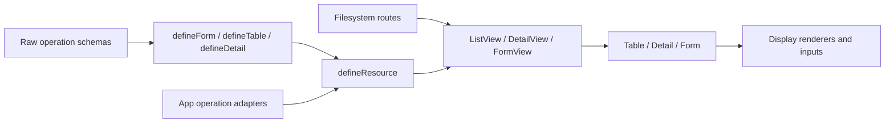

# Web application architecture

This file summarizes the current `apps/web` integration. The approved Loom
contracts live in
[resource system architecture](../resource_system_overhaul/ARCHITECTURE.md).
Read [file routing](file-routing.md) for route placement and parent ownership.

## Owners

Routes own URLs, page composition, navigation, dialogs, confirmations,
notifications, and workflow state. App adapters own transport and response
normalization. Raw schemas define record, query, create, and update contracts.
Loom constructors define one form, table, or detail surface. A resource binds
the surface bags to standard operations and access metadata.



## Route ownership

Filesystem route names are part of the app contract. Keep a parent route when
it owns the authenticated shell, persistent navigation, or a record summary
that remains visible on a child page. A child owns its query state, data load,
and workflow. Use a nested file route only when the section needs its own
identity, link, refresh, or return path.

```text
settings/roles/
  index.route.vue
  create.route.vue
  [roleId]/detail.route.vue
  [roleId]/edit.route.vue
  [roleId]/detail/permissions/index.route.vue
```

The detail page remains visible for a child section. Use named route tabs for
several child sections. Route files and Back targets must follow
[the file-routing convention](file-routing.md).

## Raw schemas and surface definitions

Keep operation schemas local to the module and export their raw Zod values and
inferred types. Use those values directly in form, table, detail, and operation
definitions.

```ts
import { z } from 'zod/v4'
import { collectionQueryFields } from '@/framework/hono/collectionQuery'

export const usersRecordSchema = user.schemas.select
export const usersCreateSchema = user.schemas.create
export const usersUpdateSchema = user.schemas.update
export const usersQuerySchema = z.object({
  ...collectionQueryFields,
  sort_by: z.enum(['name', 'email']).optional(),
  statusCode: z.string().optional(),
})

export type User = z.output<typeof usersRecordSchema>
export type UserCreate = z.input<typeof usersCreateSchema>
export type UserUpdate = z.input<typeof usersUpdateSchema>
```

Define the three UI surfaces separately. A reusable display fragment is a
plain object and can be spread into a table column or detail field:

```ts
const statusDisplay = { renderer: 'chip', props: { options: statusLabels } }

const usersTable = defineTable({
  schema: usersRecordSchema,
  labels: userLabels,
  columns: {
    name: { sortable: true },
    statusCode: { ...statusDisplay },
  },
})

const userDetail = defineDetail({
  schema: usersRecordSchema,
  labels: userLabels,
  fields: {
    name: {},
    statusCode: { ...statusDisplay },
  },
})

const createForm = defineForm({
  schema: usersCreateSchema,
  labels: userLabels,
  fields: { name: { renderer: 'text' } },
  submit: usersActions.create,
})
```

Table and detail maps select record keys. Form maps select input keys. Each
surface checks its own schema. Display fragments do not define form behavior.
Use a `read` accessor when the displayed value comes from a joined relation.
The API must return that relation data; do not fetch one label per row.

The module query schema describes the canonical Collection values. Share only
the page, limit, search, and direction fields; define sortable columns and
filters in that module's schema. Bind it to the Hono list adapter once:

```ts
const api = createHonoResourceActions(rpc.users, { querySchema: usersQuerySchema })

export const usersActions = {
  list: api.list,
  detail: api.detail,
  create: api.create,
  update: api.update,
}
```

The adapter validates the query before dispatch and encodes `sort_by` as wire
`sort` and direction `sort` as wire `order`. A resource table binds the loader
directly; it does not also receive this query schema. Keep `querySchema` on a
standalone Table only when that Table owns query validation for its loader.

## One-object resource declarations

`defineResource` receives one object with `key`, `identity`, and only the
operations that the module supports:

```ts
export const users = defineResource({
  key: 'users',
  identity: (record: Pick<User, 'id'>) => record.id,
  list: {
    permission: 'view-users',
    route: { name: 'settings-users' },
    table: { ...usersTable, load: usersActions.list },
  },
  create: {
    permission: 'create-users',
    route: { name: 'settings-users-create' },
    form: createForm,
  },
  detail: {
    permission: 'view-users',
    route: {
      name: 'settings-users-detail',
      params: id => ({ userId: String(id) }),
    },
    detail: ({ id }) => ({
      ...userDetail,
      load: context => usersActions.detail({ ...context, id }),
    }),
  },
  update: {
    permission: 'update-users',
    route: {
      name: 'settings-users-edit',
      params: id => ({ userId: String(id) }),
    },
    form: ({ id }) => ({
      ...updateForm,
      load: async context => {
        const record = await usersActions.detail({ ...context, id })
        return record ? { name: record.name } : undefined
      },
      submit: output => usersActions.update(id, output),
    }),
  },
  delete: { permission: 'delete-users', run: usersActions.delete },
})
```

Every declared standard operation has a permission string or explicit `null`.
The list and create bags are static: `users.list` and `users.create`. Detail
and update bind an identity: `users.detail({ id })` and `users.update({ id })`.
Detail and update factories are pure; they do not load data. Their returned
bags own their loaders. An update loader selects draft keys explicitly. Do not
add a flat page loader or fabricate a detail operation for an update-only
resource.

Custom commands stay under `actions`. They declare `run` and a permission,
and return guarded `can` and `run` functions. Standard operation members do
not live in `actions`.

`run` and `can` receive exactly the declared business arguments. For a
row-dependent policy, bind the row with `command.withContext({ record })` and
call `can` or `run` with those same arguments. A policy that needs a row denies
when the command has no bound record.

Resource list, detail, create, and update declarations use the matching
complete View prop contracts. The binder removes operation metadata, forwards
page options such as filters, export, back targets and completion callbacks,
and supplies the guarded primitive bags. Extracting a primitive keeps its
access and cache behavior without adding page navigation.

## Route pages

Routes pass the static or identity-bound bags directly to views:

```vue
<ListView v-bind="users.list" title="Users" />
<FormView v-bind="users.create" title="Create user" />
<DetailView v-bind="users.detail({ id })" />
<FormView v-bind="users.update({ id })" title="Edit user" />
```

The route owns the route param and converts it to the resource identity value.
Vue Router route names and params are type-checked against the generated route
map. Keep route permissions on the nested file route metadata so direct child
entry follows the same access contract as navigation.

## Data, access, and cache

Use the Hono action adapter or a typed app service in the web layer. Keep
transport out of Loom. Standard resource reads and writes use the resource
cache namespace. Successful standard writes invalidate affected collections
and records. A custom command that changes another resource invalidates that
resource through its owner.

Client permission checks control visible actions. The API repeats access and
domain checks on every request. Resource identity remains required for record
detail, update, and delete operations. Do not invent IDs for nested pages.

## Check changes

Run the source checker on a changed module route directory:

```sh
node scripts/module-ui-check.mjs --sources 'apps/web/src/routes/(authenticated)/<module>'
```

The checker follows references, aliases, and object spreads in resource surface
maps. It reports surface keys that are missing from their schema and display
maps that need a renderer, accessor, or format. It does not prove visual
acceptance, API authorization, or runtime behavior. Use the focused tests,
effective `vue-tsc` type check, and source review for those boundaries.
