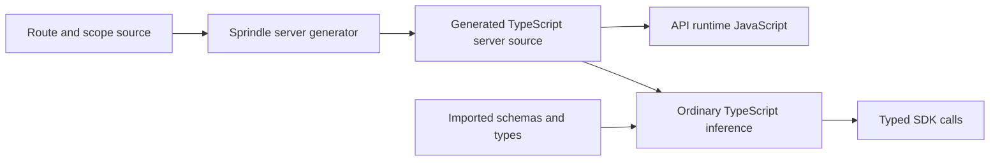

# Sprindle route type inference investigation

The requested design keeps server route generation and removes the separate RPC declaration emitter. The SDK would import a type from the generated server source. TypeScript would derive the client contract from that source and its imports.

The repository proof supports this design. A generated TypeScript server representation supplied precise SDK types and served a request through the existing Sprindle runtime. An external type-only edit changed the checked SDK response type without any server file regeneration or RPC declaration emission. The proof also checked all 24 current API route files through a projected source graph with the web app's TypeScript options.

The design requires a compiler change. The generated output must keep precise route types and expose the scope bindings that currently exist only in Sprindle's private compiler overlay. Normal frontend checks must also resolve the resulting backend source. Full Vue checks, editor behavior, runtime latency, and package delivery remain unverified. This investigation did not change application or framework source, enable Plan 086, or run database commands.

## External source findings

Sources were checked on 4 October 2026. Installed Hono 4.12.27 and TypeScript 7.0.2 were also inspected without changes.

### What Hono infers

Hono exports `AppType = typeof routes`. The client passes that type to `hc<AppType>()`. Hono obtains request types from validators and response types from handlers that return `c.json()`. Explicit response status codes form part of the response type. The guide requires `strict: true` in the server and client configurations. It recommends chained route registration so that the final value keeps the complete inferred type. [Hono RPC guide](https://hono.dev/docs/guides/rpc)

The implementation explains why this works. Route registration returns a new static Hono type whose schema includes the route. The client extracts that schema generic and maps its paths to client methods. The client does not inspect the running server or its route list. [Hono route types at version 4.12.27](https://github.com/honojs/hono/blob/v4.12.27/src/types.ts), [Hono client types at version 4.12.27](https://github.com/honojs/hono/blob/v4.12.27/src/client/types.ts)

Hono also documents limits. Global error handlers do not automatically supply RPC response types. Many routes can cause slow editor inference. The guide recommends precompilation as one remedy. These are reasons to check contract completeness and editor cost before adopting the same model. [Hono RPC guide](https://hono.dev/docs/guides/rpc)

### The client needs source with type information

TypeScript removes type annotations when it emits JavaScript. The emitted JavaScript cannot retain those annotations as type declarations. [TypeScript erased types](https://www.typescriptlang.org/docs/handbook/2/basic-types.html#erased-types)

JavaScript is not always untyped: TypeScript can infer types from expressions and can read JSDoc annotations. But a generic call with insufficient inference input can produce `any`. Thus a generated JavaScript module must be checked on its actual structure; its existence alone does not establish a complete RPC type. [TypeScript checks for JavaScript files](https://www.typescriptlang.org/docs/handbook/type-checking-javascript-files.html#unspecified-type-parameters-default-to-any)

TypeScript can resolve a runtime import path to TypeScript source. For a `.js` path it checks corresponding `.ts` files. For a `.mjs` path it checks `.mts`, then `.d.mts`, then `.mjs`. A `.ts` file with the same stem is not the source candidate for a `.mjs` import. [TypeScript file extension substitution](https://www.typescriptlang.org/docs/handbook/modules/reference.html#file-extension-substitution)

Inference for Sprindle: a generated `.ts` or `.mts` server representation can be the normal source for both runtime compilation and client type inference. It must import source that the client checker can understand. Retaining only the executable bundle may discard information needed by the SDK.

### A type import controls runtime output

`import type` is removed from emitted JavaScript. It can also import a value for use through `typeof`, without adding that value to runtime output. [TypeScript type imports](https://www.typescriptlang.org/docs/handbook/modules/reference.html#type-only-imports-and-exports)

This does not isolate backend source from the client type checker. Imported files can enter the TypeScript program even when the client configuration excludes them. `exclude` changes the files found by `include`; it does not block imports. [TypeScript exclude option](https://www.typescriptlang.org/tsconfig/#exclude)

Inference for Sprindle: a type import can keep server code out of the browser output while still making the client checker resolve backend source and type dependencies. Their syntax, module paths, environment types, and compiler options must be checked. A type import alone does not prove that the web checker can consume the API source.

### Project references usually retain declarations

Standard TypeScript project references load the referenced project's output `.d.ts` files. Referenced projects require `composite` and declaration output. Build mode prepares dependencies in order. VS Code can use an in-memory declaration process to reduce missing-output errors, but this also has a performance cost. [TypeScript project references](https://www.typescriptlang.org/docs/handbook/project-references.html#what-is-a-project-reference), [Project reference caveats](https://www.typescriptlang.org/docs/handbook/project-references.html#caveats-for-project-references)

Inference for Sprindle: project references can enforce a project boundary, but their standard build contract does not remove declaration generation. Direct source imports are the simpler candidate for the requested development model. Published packages may still need declarations; that is a separate delivery requirement.

### Compiler overlays must reach each consumer

Microsoft's Compiler API guide supplies source text, module resolution, and file versions through the host used to create a compiler or language service. An altered host belongs to that service. [TypeScript Compiler API guide](https://github.com/microsoft/TypeScript/wiki/Using-the-Compiler-API#incremental-build-support-using-the-language-services)

The installed TypeScript 7.0.2 API likewise accepts filesystem callbacks through its `APIOptions.fs`. Its virtual filesystem keeps its own file contents. These contracts were read from `packages/sprindle/node_modules/typescript/dist/api/options.d.ts`, `fs.d.ts`, and `fs.js`.

Inference for Sprindle: valid TypeScript supplied only to an API compiler overlay is not automatically available to an independent SDK checker, web checker, or editor service. Either the generated valid source must be available as ordinary files, or each consumer needs an explicit integration that supplies the same lowered source.

An ordinary TypeScript language service plugin does not provide a general CLI solution. Microsoft states that these plugins change the editing experience and are not loaded by normal `tsc` checks or emit. [TypeScript language service plugin limits](https://github.com/microsoft/TypeScript/wiki/Writing-a-Language-Service-Plugin#whats-a-language-service-plugin)

## What the current generator loses

The runtime generator creates a route list that imports handlers and scopes. Its published development output is JavaScript. Path literals have no explicit TypeScript literal constraint. The separate emitter constructs `RouteContract` and declaration trees through a semantic compiler pass. [Manifest generator](../../packages/sprindle/src/tooling/manifest.ts)

The current runtime loader returns `Promise<FileRouteManifest>`. That public manifest type uses `string` paths and `Record<string, unknown>` handlers. Installation returns the original Hono app type, without adding the manifest's endpoint schema. Thus `typeof app` on today's server does not recover the API contract. [Manifest loader and installer](../../packages/sprindle/src/hono/index.ts), [Manifest types and route installation](../../packages/sprindle/src/hono/file-routes.ts)

The deeper issue is scope inference. A source route imports `list`, `create`, or `defineRoute` from the framework package. Those ordinary imports do not describe the file's parent scope. Sprindle's overlay redirects each import to a private local helper. That helper binds the inherited entity, context, identity, and path parameters through `typeof import(parent).default` and the existing generic route types. [Overlay and helper construction](../../packages/sprindle/src/tooling/language.ts), [Generic scope and route definitions](../../packages/sprindle/src/routes/definition.ts)

A precise manifest that imports the original route files therefore does not solve scope inference. The fixture showed both failures: an unbound CRUD helper accepted an invalid JSON shape, and an inherited context reference produced a compiler error.

## The source representation that worked

The proof writes the existing overlay as ordinary TypeScript files in an owned temporary directory. It replaces virtual helper declarations with executable helper modules. These modules re-export the existing runtime helpers with the same scope-specific generic types that Sprindle already uses. They derive parent types through imports. They do not calculate or serialize endpoint input and output shapes.

The generated manifest preserves literal HTTP paths and concrete handler module types. A small generic type maps each manifest entry and HTTP handler export to the `path`, `method`, and `definition` shape expected by the SDK. This is a type expression evaluated by the consumer's TypeScript checker. It has no separate emitter or publication process.

The fixture copies the actual SDK client source and changes only the route contract import. Its existing conversion from `FileRouteDefinition` to Hono's schema still supplies request shapes, response bodies, status codes, and declared error unions. A rewrite of the SDK transport is not required for the basic mechanism. [SDK conversion](../../packages/sdk/src/client.ts)



This meets the requested distinction: server generation includes structural TypeScript bindings, while client types follow from the generated server source. Ordinary dependency declarations still exist. The removed step is RPC declaration emission, rather than all uses of `.d.ts` files.

## Proof results

The [proof script](proofs/sprindle-route-type-inference.mjs) creates and removes isolated fixtures. It uses the installed TypeScript 7.0.2 compiler, Sprindle overlay and route discovery, actual SDK conversion, Hono runtime, and esbuild. It adds no production test hooks. The [recorded results](proofs/sprindle-route-type-inference.results.json) include compiler diagnostics and one comparison of the current and proposed source graphs.

Run from the repository root:

```sh
node --import ./apps/api/node_modules/tsx/dist/loader.mjs docs/findings/proofs/sprindle-route-type-inference.mjs
```

| Check | Result |
|---|---|
| Simple custom route inferred from TypeScript server source | Valid consumer passed; wrong response assignment failed |
| Original CRUD helper imported without its scope binding | Invalid JSON input passed, which confirms loss of input precision |
| Original route with inherited context | Compiler rejected the unavailable context properties |
| Projected scopes and routes | Valid create, update, delete, list, and custom route calls passed |
| Request and response precision | Wrong create input, missing path parameter, unknown endpoint, and wrong output assignment failed for their intended reasons |
| Entity and scope types | Raw request inputs, enriched response fields, replaced child context, and explicit response status remained precise |
| External type-only edit | Changing `Version` from `number` to `number \| string` invalidated the old SDK consumer; the updated consumer passed |
| Generation during that type-only edit | All generated server source files kept the same content hash |
| Browser output | Bundled client inputs contained no server route, scope, manifest, or schema runtime modules |
| Runtime use of the same generated manifest | Existing `installSprindle` served `/users/one` with status 202 and the expected inherited context values |
| Current API source | A projected graph of all 24 route files passed a real users-list SDK consumer check under the web app's TypeScript options |
| Current API type precision | Assigning the users-list response name to a number failed with TS2322 |

The projected source check is not the full web app check. It uses a small consumer with inherited web compiler options. The fixture's successful runtime request is not a proof of every API operation. Response error unions use the existing SDK rules; this investigation did not audit those rules against every runtime error path.

## Cost of source inference

Both the current declaration consumer and the projected source consumer passed on Node 26.9.0. The comparison uses the same compiler options and explicitly supplies Node type definitions to both consumers. The separate API source check inherits the web app's options without that addition. The current consumer read 613 files and reported about 120 MiB of compiler memory. The projected consumer read 1,746 files and reported about 250 MiB. These are single samples from a small consumer, not a performance benchmark or an editor latency result. [Compiler reports](proofs/sprindle-route-type-inference.results.json)

The design removes a separate type compiler from the API development process. The consumer checker must then analyze more backend source. This shifts work into normal TypeScript inference. Full web checks and editor completion latency must determine whether that cost is acceptable. The proof did not measure API restart latency.

## Proposed implementation direction

Use one canonical generated TypeScript server source graph for both runtime compilation and SDK inference. Keep the generated JavaScript as executable output from that graph. Export the source's inferred contract through the existing API package entry, with the correct `.ts` or `.mts` resolution. The current generic SDK conversion can consume it.

Make contextual scope bindings part of the same server generation pass. Preserve author source paths in diagnostics and runtime source maps. Keep imported dependencies live where possible, and update transformed route source through the existing server watcher. Route additions, moves, and deletions still require generation because TypeScript does not discover filesystem routes by itself.

For development, this is an alternative to the independent declaration worker in Plan 086. Standalone builds and checks must ensure that the canonical server source exists and describes the current route structure. Concurrent route generators still need consistent ownership of that source. Removing a separate type publisher does not remove all publication concerns.

## Remaining verification

- Run full SDK and Vue checks with the source contract, and check editor diagnostics, completion latency, and type-only dependency updates in a persistent session.
- Compare normal API startup and update latency, full web check cost, and memory on representative route graphs.
- Prove route add, move, delete, scope changes, failed compilation recovery, and concurrent standalone generation through the normal development entry.
- Check backend and frontend module resolution, including aliases, `.server` and `.web` suffixes, ambient types, and external workspace dependencies. An imported backend source file does not automatically retain the API project's compiler options.
- Prove diagnostic and runtime source maps, installed package behavior, cold startup, and worker-free shutdown.
- Confirm how published SDK consumers obtain the source graph. A separate declaration build can remain useful for published packages even if local development needs none.

The recommended next step is a compiler prototype that makes the current server generation path produce this source graph. Use the same graph for runtime compilation and a complete frontend check. Evaluate editor cost before selecting this design as the replacement for Plan 086. No plan status was changed in this investigation.
