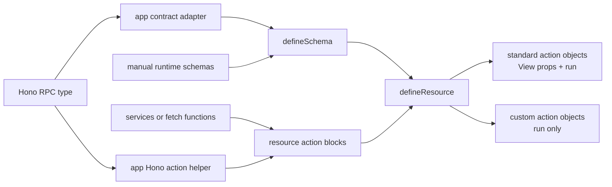

# Frontend Resource and Schema Architecture

- **Status:** Approved design
- **Date:** 2026-08-11
- **Scope:** `apps/web` and the resource APIs in `packages/is-vue-framework`

## Purpose

Make frontend resource code easy to read. Keep the data contract, validation,
application actions, view fields, access rules, and routes in clear ownership
boundaries.

This design replaces the current split between `*.operations.ts` and
`*.resource.ts`. The normal feature has two files:

```text
users.schema.ts
users.resource.ts
```

An extra action file is allowed only when application functions are too large
for the resource file.

## Problems in the Current API

The current API splits one standard operation across peer properties:

- `schemas.create` and `schemas.update` own runtime validation;
- `capabilities.create` and `capabilities.update` own handlers, access, and routes;
- `form` owns fields for both create and update;
- `table` owns list fields;
- `detail` owns detail fields.

Type facts also move through `*.operations.ts`, `defineFields`, and sometimes
explicit `defineResource` generic arguments. This makes the same operation hard
to trace.

The current `*.operations.ts` files also mix several concerns. They can contain
Hono type extraction, network calls, response mapping, domain functions, and UI
effects. For example, a browser confirmation currently exists in a user update
function. A transport or data function must not own a browser dialog.

## Design Principles

1. The schema is a web data contract. It does not know Hono, services, fetch,
   Vue, routes, or permissions.
2. The schema owns all frontend validation for the standard resource contract.
3. A resource is a set of named application actions.
4. A standard action owns its run function, fields, permission, and route in one
   block.
5. Each view owns complete field definitions. There is no shared framework field
   catalog with a second view selection layer.
6. Plain constants and object spread provide reuse. The framework does not add
   field or schema inheritance.
7. Custom actions are ordinary application functions. The framework does not
   classify their HTTP method, input, output, permission, or invalidation.
8. Routes own dialogs, confirmations, toasts, navigation, and multi-resource
   workflows.
9. The backend remains the authority for access and validation.
10. There is one canonical execution path for each action.

## Architecture



### Framework core

The framework core owns:

- `defineSchema`;
- `WebResourceSchema` and its type extractors;
- `defineResource`;
- standard resource action and View contracts;
- validation execution;
- standard resource invalidation;
- `ListView`, `DetailView`, and `FormView` mapping from `run` to the existing core
  `load` or `submit` contracts.

The framework core does not import Hono or application adapters.

### Application adapters

`apps/web` owns:

- a type-only Hono-to-web contract adapter;
- a Hono helper that returns standard action functions;
- legacy services and plain fetch action functions;
- wire response and error normalization.

Hono support is an application implementation detail. It is not a second core
schema language.

## Unified Schema

The core exposes one builder: `defineSchema`.

For Hono projects, an app-level type adapter derives the standard web contract
from the typed client route:

```ts
export const usersSchema =
  defineSchema<AppResourceContract<typeof rpc.users>>({
    identity: 'id',
    record: { schema: userRecordSchema },
    query: { schema: userQuerySchema },
    create: {
      schema: createUserSchema,
      validators: createValidators,
    },
    update: {
      schema: updateUserSchema,
      validators: updateValidators,
    },
  })
```

`AppResourceContract` is app code. It uses Hono client types to derive:

- the record from the successful list row or detail payload;
- the query from the list request query;
- the create input from the create request JSON;
- the update input from the update request JSON;
- the identity from the standard route parameter.

The local runtime schemas must be type-compatible with this derived contract.
There is no code generation.

For services or plain fetch, runtime schemas are the type source:

```ts
export const usersSchema = defineSchema({
  identity: 'id',
  record: { schema: userRecordSchema },
  query: { schema: userQuerySchema },
  create: {
    schema: createUserSchema,
    validators: createValidators,
  },
  update: {
    schema: updateUserSchema,
    validators: updateValidators,
  },
})
```

### Validation ownership

The schema owns:

- field constraints;
- cross-field constraints;
- input transforms;
- synchronous custom validators;
- asynchronous custom validators;
- validation triggers and issue paths.

Zod or another runtime schema owns shape and data rules. Custom JavaScript
validators own rules that need application context or asynchronous work.

The framework Zod bridge is schema-first:

```ts
const createUserFormSchema = createUserSchema.extend({
  systemRoleIds: z.array(systemRoleSelection).min(1),
})

const create = { schema: fromZod(createUserFormSchema) }
```

`fromZod(schema)` infers the parsed output for classic Zod and `zod/v4`.
Callers do not provide an output type. A local form schema may accept a UI
shape and transform it into the transport shape. A raw input type is local to a
real function boundary and is not a generic on the resource schema.

If create and update have the same definition, use a plain constant:

```ts
const write = {
  schema: userWriteSchema,
  validators: [validateUser],
}

export const usersSchema = defineSchema({
  record: { schema: userRecordSchema },
  create: write,
  update: write,
})
```

If a frontend runtime schema does not exist for a contract part, its `schema`
value can be absent. Validation cannot move to the resource or field config as a
fallback.

The schema does not describe custom resource actions. A custom action can be a
mutation, an alternate collection query, an export, or another application
function. A standard schema for all of these would be a false abstraction.

## Per-Action Resource

The resource receives the schema value. Define one adjacent field set with
`defineFields(schema, definitions)`, then pass ordered references to actions.

```ts
const api = appHonoTransport(rpc.users)
const fields = defineFields(usersSchema, {
  name: { label: 'Name', form: { renderer: 'text' } },
  email: { label: 'Email', form: { renderer: 'text', props: { type: 'email' } } },
  statusCode: { label: 'Status', form: { renderer: 'radio' } },
})

export const users = defineResource(usersSchema, {
  key: 'users',

  actions: {
    list: {
      run: api.list,
      fields: [fields.name, fields.email, fields.statusCode],
      permission: 'view-users',
      route: { name: 'settings-users' },
    },

    detail: {
      run: api.detail,
      fields: [fields.name, fields.email, fields.statusCode],
      permission: 'view-users',
      route: {
        name: 'settings-users-detail',
        params: (id) => ({ userId: id }),
      },
    },

    create: {
      run: api.create,
      fields: [fields.name, fields.email],
      permission: 'create-users',
      route: { name: 'settings-users-create' },
    },

    update: {
      run: api.update,
      fields: [fields.name, fields.statusCode],
      permission: 'update-users',
      route: {
        name: 'settings-users-edit',
        params: (id) => ({ userId: id }),
      },
    },

    delete: {
      run: api.delete,
      permission: 'delete-users',
    },

    verify: {
      run: verifyUser,
    },

    archived: {
      run: listArchivedUsers,
    },
  },
})
```

### Standard actions

The reserved standard names are:

- `list`;
- `detail`;
- `create`;
- `update`;
- `delete`.

The framework gives these names typed standard behavior. `list`, `detail`,
`create`, and `update` can produce standard View props. `delete` has no standard
View.

The action block is the only location for:

- the application run function;
- complete fields for that view;
- static access metadata that the framework consumes;
- a standard route target;
- standard view options.

There is no root `transport` object because it would split one operation between
`transport.list` and `list` view config.

### Schema-bound field references

`defineFields(schema, definitions)` returns immutable references. A definition
keeps shared `label`, `read`, and `write` values at its root and puts surface
behavior in `display`, `table`, `detail`, and `form` projections.

```ts
const roleFields = defineFields(rolesSchema, {
  name: { label: 'Role name', form: { renderer: 'text' } },
  realm: { label: 'Realm', form: { renderer: 'radio', source: realmOptions } },
})

const createFields = [roleFields.name, roleFields.realm]
const updateFields = [
  roleFields.name,
  roleFields.realm.override({ form: { behavior: { disabled: () => true } } }),
]
```

Each standard action selects its fields with an ordered array. Omission removes
a field from that View. The override is one terminal partial patch; its result
has no second override method. Raw field catalogs remain valid for direct
`Table`, `Detail`, and `Form` screens, not for standard resource actions.

### Custom actions

Any non-standard key is a custom action. A custom action block contains `run`.
The function keeps its inferred argument and result types.

The framework does not add:

- an action schema;
- a permission field;
- an HTTP method or transport kind;
- automatic validation;
- automatic invalidation;
- generated UI.

The route decides whether to show a custom action control. The action
implementation and backend enforce their own requirements. The caller performs
explicit invalidation after a custom action when required.

## Canonical Public API

Each standard factory returns one object. That object is both the exact View prop
bag and the only holder of `run`.

```vue
<ListView v-bind="users.list()" />
<DetailView v-bind="users.detail({ id: userId })" />
<FormView v-bind="users.create()" />
<FormView v-bind="users.update({ id: userId })" />
```

The same objects execute the standard actions:

```ts
await users.list().run(context)
await users.detail({ id: userId }).run()
await users.create().run(input)
await users.update({ id: userId }).run(input)
await users.delete({ id: userId }).run()
```

Custom actions also use `run`:

```ts
await users.actions.verify.run(input)
await users.actions.archived.run(query)
```

There is no second standard action namespace. The API does not expose
`users.actions.list`, a factory-level `users.list.run`, `.props`, or `.view`.

`ListView`, `DetailView`, and `FormView` declare `run` as a prop. They map it to
the transport-neutral core `load` or `submit` prop. `run` does not leak through
Vue attribute fallthrough.

## Data and Error Flow

1. A route creates a standard action object, such as `users.update({ id })`.
2. The resource binds the update action, update schema, update validators, update
   fields, route, permission, and record identity.
3. `FormView` loads initial data through the matching detail action when needed.
4. The schema validates the visible draft and returns parsed input or issues.
5. `run` sends parsed input through the application function.
6. The application function returns a normalized record or throws an error.
7. Standard create, update, and delete actions invalidate resource data after
   success.
8. The app error adapter converts failed requests to the common error shape.
9. The View displays load, validation, submit, and delete feedback.

Application action functions must not show toasts, dialogs, or navigation. A
route can wrap a standard View action when it needs a confirmation or another UI
workflow.

## Routing and Access

Standard action routes and permissions remain in their action blocks because the
framework consumes them for standard controls, row actions, and route access.

Custom actions have no framework permission metadata. Their buttons are
route-owned. A route can use server-provided allowed actions, the application
permission store, or both. Backend authorization remains authoritative.

## Testing

Tests must protect contracts and observable behavior. They must not copy every
resource configuration.

Required framework checks:

- schema type inference for an app-derived contract and a manual schema;
- compatibility checks between runtime schemas and the declared contract;
- exact standard action availability;
- contextual field types for each standard View;
- one standard action object serving as View props and the only `run` holder;
- create, update, and delete invalidation;
- Zod and custom JavaScript validator execution from the schema;
- custom action type preservation;
- no Hono import in framework core.

Required app checks:

- one simple Hono-backed resource;
- one complex resource with different create and update fields;
- one manual services or fetch resource fixture;
- one route-owned custom action workflow;
- route and access behavior for standard actions.

Verification commands:

```sh
pnpm --filter @southneuhof/is-vue-framework test
pnpm --filter @southneuhof/is-vue-framework type-check
pnpm --filter @southneuhof/framework-web test
pnpm --filter @southneuhof/framework-web type-check
pnpm --filter @southneuhof/framework-web lint:check
git diff --check
```

## Migration Strategy

Improve must write the implementation plans before module migration begins.

Planning rules:

- framework foundations have separate plans;
- application contract and Hono action helpers have separate plans;
- web PTS removal has a separate plan and happens before resource migration;
- the current web PTS routes, resource, action code, and tests are removed;
- backend PTS code remains;
- the migration skill is created with Skill Creator before the first module
  migration and does not require an Improve plan;
- each application module has one plan;
- one module plan cannot include another module;
- dependency order is explicit in the plan index.

Implementation rules:

- no compatibility wrappers;
- no old and new public resource APIs after the complete migration change;
- no generic module migration that edits several modules at once;
- no framework package change during module migration without a separate approved
  framework plan;
- no migration of the removed PTS module;
- PTS is rebuilt after this architecture migration as new work.

## Rejected Designs

### Root transport plus separate View config

Rejected because `transport.list` and `list` View config split one operation
between two locations.

### Complete custom action schema

Rejected because custom actions are not one kind of operation. They can be
mutations, alternate lists, exports, or other functions. A common action schema
would create a second language that must match application functions.

### Global field catalog plus View selectors

Rejected because a global catalog would separate module ownership from schema
identity. Each module owns one adjacent field set, and each action selects
references in its own order.

### Fields that declare all View membership

Rejected because a resource cannot read one View from one block, and different
View orders become difficult.

### Separate raw standard action namespace

Rejected because both `users.list().run(...)` and `users.actions.list(...)`
would be valid. Agents and developers need one canonical path.

### Hono-specific core schema builders

Rejected because the schema is a web language. Hono type and action adaptation
belong in `apps/web`.

## Acceptance Criteria

The architecture is complete when:

1. A Hono-backed feature and a services or fetch feature both use
   `defineSchema` and `defineResource`.
2. Normal resource code uses one `defineFields(schema, definitions)` call and
   no explicit resource generic list.
3. Validation exists only in `*.schema.ts` for standard resource data.
4. Each standard action can be read from one resource block.
5. Each standard View can be read from its action's ordered field references.
6. Every standard action has one execution path through the returned action
   object's `run`.
7. Custom actions remain plain functions exposed as `{ run }`.
8. Framework core source has no Hono or app transport dependency.
9. The current web PTS module is absent.
10. Improve provides separate plans for framework work, adapters, PTS removal,
    and every remaining module.
