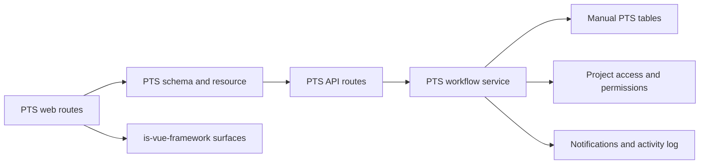
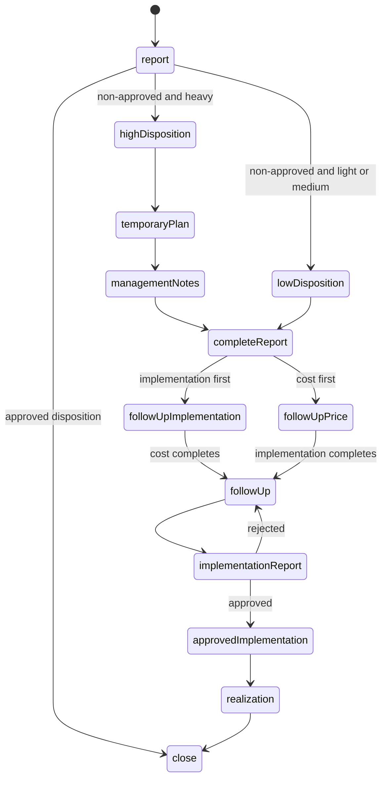
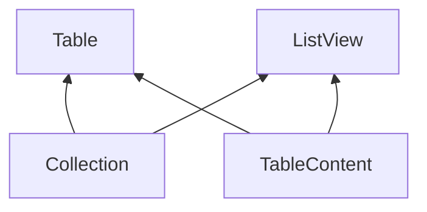

# Manual PTS Parity Design

- **Status:** Approved
- **Date:** 2026-08-12
- **Scope:** Manual Produk Tidak Sesuai (PTS), from report creation to closure
- **Legacy source:** `/Users/gamer/Documents/projects/ads-hk-legacy`

## Goal

Replace the current PTS-specific draft with a clean implementation of the
legacy manual PTS process. Keep the business process and visible screen content
at parity with the legacy application. Use the current application framework,
authorization model, and shared services.

This design does not keep a compatibility layer for the current PTS draft.

## Approved scope

The first slice includes:

- manual report list, card grid, creation, detail, and pre-disposition edit;
- Quality/PTS navigation and PTS notification links to the new routes;
- the complete manual workflow from creation to closure;
- project-scoped authorization and criteria-specific disposition permissions;
- report numbering;
- retained image uploads;
- root-cause selection;
- notifications and activity history;
- reason-based soft delete from the list and detail screens;
- current-data refresh after every successful form submission; and
- a framework Collection surface for the grid and table presentations.

The first slice does not include:

- Quality Inspection input or integration;
- Quality Inspection PTS states or fields;
- Consultant-specific behavior;
- Contractor-specific behavior;
- any other creator-role-specific workflow behavior;
- historical data import;
- the closed-report print or PDF export; or
- the dead process-image-only implementation path.

Record the omitted role behavior as a product decision for a later design. Do
not add placeholder fields, states, branches, or role checks for it now.

## Source findings

The legacy manual PTS process is split across the Laravel `QhssePts` model,
ten PTS services, step-code and permission seeders, the Vue PTS configuration,
and the Vue PTS detail screen.

The current API draft changes legacy fields and transitions. It adds target
dates and text fields that the legacy process does not have, changes state
names and disposition values, omits legacy assignee and cost fields, and uses
hard delete. These differences are business changes. The design replaces the
draft instead of repairing it.

The supplied mobile legacy repository has no PTS implementation. All frontend
history calls the implementation-report endpoint from one web form. From its
first revision, that form requires the process image, after image, and
completion date. The backend-only process-image update has no frontend caller
and is out of scope.

## Architecture



Use these boundaries:

1. Routes own navigation, dialogs, confirmation, toast messages, list
   presentation choice, and cache invalidation after custom actions.
2. The web schema and resource own standard fields, labels, option values,
   create and update validation, and transport actions.
3. The API schema owns all trust-boundary validation.
4. One PTS workflow service owns transitions and transaction execution.
5. The database owns relations, uniqueness, and transaction-safe numbering.
6. The API is the authority for access, current-step checks, and assignee
   checks. Web action visibility is only a user-interface aid.

Reuse the current authentication, project coverage, roles, permissions, number
configuration, upload service, lookup modules, notifications, and activity
logs. Do not change their public behavior for PTS.

## Manual PTS data model

Replace the current `qhsse_pts` shape with the manual fields below.

### Report fields

- `id`
- `divisionId`
- `projectId`
- `number`
- `ptsWorkCategoryId`
- `workItemCategoryId`
- `workItemId`
- `locationZone`
- `criteriaCode`
- `imgBefore`
- `location`
- `description`

### Workflow fields

- `somUserId`
- `dispositionStatusCode`
- `temporaryFollowUpPlan`
- `managementNotes`
- `followUpPlan`
- `targetDate`
- `implementationUserId`
- `workMethod`
- `estimationCost`
- `jobImplementorType`
- `projectVendorId`
- `implementationDate`
- `imgProcess`
- `imgAfter`
- `implementationDescription`
- `implementationStatusCode`
- `implementationVerificationDescription`
- `actualCost`
- `actualJobImplementorType`
- `actualProjectVendorId`
- `statusCode`
- `stepCode`

### Audit and soft-delete fields

- `createdBy`
- `updatedBy`
- `createdAt`
- `updatedAt`
- `deletedBy`
- `deletedAt`
- `deletedReason`

Do not add the legacy `date`, `source`, singular `rootCauseCode`,
`rejectedNotes`, `ptsNotes`, or creator `roleId` columns. They are unused by
the approved manual process or belong to a deferred integration.

Use a `qhsse_pts_root_cause` join table with `qhssePtsId` and `rootCauseId` as
its composite primary key. A report must have at least one root cause.

Use a project-and-year counter in the same transaction as report creation.
Format the number with the existing active number configuration. A concurrent
create must not allocate the same number.

Normal list and detail queries exclude soft-deleted reports. Soft delete does
not delete image assets or child root-cause rows.

## Field rules

### Create and pre-disposition edit

The form contains these legacy fields in this order:

1. division;
2. project;
3. PTS work category;
4. work-item category;
5. work item;
6. work area or zone;
7. criteria;
8. one or more root causes;
9. location;
10. before image; and
11. finding description.

Division, project, PTS work category, work-item category, work item, criteria,
root causes, location, and before image are required. Work area or zone and
description remain optional, as in the legacy API contract.

Project options are limited to the caller's active `create-qhsse-pts` project
scope. The selected project must belong to the selected division. The
work-item category and leaf item must be active, belong to the project, and
have the selected ancestor relation. Root causes must be active.

The caller can edit the report only while `stepCode` is `report` and before a
disposition action succeeds. Edit can replace the selected root causes in the
same transaction.

### Disposition

Use these stored values and visible labels:

- `approved`: Tetap Dipakai
- `repair`: Diperbaiki
- `downgrade`: Diturunkan Mutu (dengan persetujuan pengguna jasa)
- `demolish`: Dibongkar dan Dikerjakan Ulang

The disposition action does not require a note.

### High-criteria branch

Heavy reports use the temporary-plan and management-notes steps after a
non-approved disposition. Light and medium reports go directly to analysis.
The temporary plan and management notes each require one text value. Do not
add target dates to these two actions.

### Analysis

All creators use the same analysis form. It requires:

- a SOM or maintenance-manager user;
- the corrective action; and
- the target completion date.

The user lookup contains active users with effective coverage for the report
project. No creator-role exception changes this form in the first slice.

### Parallel follow-up

The implementation follow-up requires an implementation user and work-method
notes. The cost follow-up requires estimated cost and the cost-bearer type.
When the type is `vendor`, an active vendor for the report project is required.
Use `internal` and `vendor` as stored cost-bearer values. The visible vendor
label includes Vendor/Subkon.

The two follow-ups can finish in either order. The report reaches `follow-up`
only after both are complete.

The implementation-user lookup contains active users with effective coverage
for the report project. Only the selected implementation user can submit the
implementation report. The caller must also have the implementation-report
permission in the report project.

### Implementation, verification, and realization

The implementation report requires:

- completion date;
- process image; and
- after image.

Implementation description is optional. A partial implementation report does
not exist in this slice.

Verification uses `approved` or `rejected`. Verification notes are optional.
A rejection returns the report to `follow-up`, where the selected
implementation user can submit a complete replacement report. Approval always
continues to repair-cost realization in this slice.

Realization requires actual cost and the actual cost-bearer type. When the type
is `vendor`, an active vendor for the report project is required. After
realization, a permitted user can close the report.

## State machine

Use the exact legacy manual state values below.



The stored step codes are:

- `report`
- `high-disposition`
- `low-disposition`
- `temporary-plan`
- `management-notes`
- `complete-report`
- `follow-up-implementation`
- `follow-up-price`
- `follow-up`
- `implementation-report`
- `approved-implementation`
- `realization`
- `close`

The stored status codes are `open`, `on-progress`, and `close`.

- Creation sets `open/report`.
- An approved disposition sets `close/close`.
- A non-approved disposition sets `on-progress` and the applicable next step.
- Closure sets `close/close`.

Do not add `analysis`, `implementation`, `verification`, `closed`, or
role-specific state values from the current draft.

## Workflow service

Keep the workflow PTS-specific. Do not create a generic workflow engine.

Define one action catalog. Each action entry contains:

- its input schema;
- its project permission;
- its allowed source step or steps;
- its state update;
- its next-step rule;
- its activity name and description; and
- its next notification target or targets.

One executor must:

1. parse input;
2. verify project coverage and permission;
3. start a transaction;
4. lock the report row;
5. reject a deleted, repeated, or invalid transition, and reject a closed
   report for every action except soft delete;
6. verify action-specific references and the implementation assignee;
7. update the report;
8. write one activity entry;
9. write the required notifications; and
10. commit and return the current detail response.

The executor removes the repeated permission, activity, and notification code
from the legacy services. It does not change the approved transitions.

## Authorization

Use the current project authorization model. Effective permissions are the
union of all active role grants that cover the project through `all_projects`,
`division`, or `project` coverage.

Use these PTS permissions:

- `view-qhsse-pts`
- `show-qhsse-pts`
- `create-qhsse-pts`
- `update-qhsse-pts`
- `delete-qhsse-pts`
- `low-disposition-qhsse-pts`
- `high-disposition-qhsse-pts`
- `temporary-plan-qhsse-pts`
- `management-notes-qhsse-pts`
- `complete-report-qhsse-pts`
- `follow-up-implementation-qhsse-pts`
- `follow-up-price-qhsse-pts`
- `implementation-report-qhsse-pts`
- `verify-implementation-qhsse-pts`
- `realization-qhsse-pts`
- `close-qhsse-pts`

Light criteria requires the low-disposition permission. Medium and heavy
criteria requires the high-disposition permission. Use the same rule in the
web and API. Remove the generic disposition permission from the PTS action
contract.

List access returns only reports in projects for which the caller has view
permission. Detail access outside project coverage returns not found. A caller
with project coverage but without the required action permission receives
forbidden.

No numeric role ID or role code controls a transition in this slice.

## API surface

Keep standard list, detail, create, and update operations. Update is available
only at `report`.

Use one typed custom action endpoint for workflow actions. Supported action
names are:

- `disposition`
- `temporary-plan`
- `management-notes`
- `complete-report`
- `follow-up-implementation`
- `follow-up-price`
- `implementation-report`
- `verify-implementation`
- `realization`
- `close`
- `delete`

Delete is a custom action because it requires `deletedReason`. Do not expose a
standard hard-delete resource action.

The list response includes display names, criteria and status values, image
references, root-cause names, and allowed record operations needed by both
presentations. The detail response includes all report fields, relation display
values, root causes, ordered activity, and `availableActions` after all API
checks.

The lookup response must apply project scope and active-state rules. It can
return divisions, projects, work items, PTS work categories, root causes,
project users, and project vendors needed by the active form.

## Notifications and activity

Create one activity entry for creation and each successful action, including
soft delete. Keep the visible Indonesian activity meaning from the legacy
process. Include actor, project, division, report reference, resulting step,
resulting status, optional verification decision, optional note, and time.

Notify active users whose effective project permission matches the next action.
Use current project-coverage rules and remove duplicate recipients. Do not
notify the actor.

After creation, notify the low-disposition permission group for a light report
or the high-disposition permission group for a medium or heavy report.
After analysis, notify both the implementation follow-up and cost follow-up
permission groups. After one follow-up completes, notify only the permission
group for the unfinished follow-up. Verification rejection must also notify
the selected implementation user. Closure sends the final PTS completion
notification.

Notification and activity writes are part of the workflow transaction.

## Web screens

### List

Keep the legacy screen structure:

- status tabs for all, open, on progress, and closed reports;
- search;
- start-month, end-month, and root-cause filters;
- grid and table presentation switch;
- create action;
- list export through the existing `ListView` export path;
- detail action; and
- reason-based soft delete.

The grid card shows reporter, report time, before and after images, criteria,
status, project, division, number, PTS work category, work-item category,
work area or zone, root causes, and description. It also shows the same detail
and delete actions as the table.

Keep the PTS card presentation in `PtsCardGrid.vue`. Do not add a generic card
grid component until a second application consumer needs the same contract.

### Create and edit

Use `FormView` with schema-bound fields. Keep dependent division, project,
work-item category, and leaf-item lookups. Use framework radio,
checkbox-group, location, image, lookup, and text-area renderers.

### Detail

Keep the legacy composition:

1. before, process, and after images;
2. report summary with criteria and status chips;
3. completed process sections in business order;
4. the available current action;
5. a separate verification card when verification is available; and
6. activity history.

Use `Detail` inside framework `Card` components for each section. Use
`DialogForm` for each form action and `ConfirmationDialog` for closure. Use a
`DialogForm` for delete because a reason is required.

The route renders action controls only from `availableActions`. It does not
reimplement transition rules.

## Framework Collection foundation

The current `ListView` body slot supplies only Table input props. It does not
supply loaded rows. A custom card grid would have to duplicate loading, query,
error, and pagination logic. Add a framework Collection foundation before the
PTS web module.

The dependency direction is:



- `Collection` owns loading, cache identity, controlled or namespaced query,
  search, filters, sorting values, empty and error states, pagination, and
  refresh.
- `TableContent` is an internal presentation for already-loaded rows.
- `Table` composes `Collection` and `TableContent`. Its normal public call stays
  the natural standard-table path.
- `ListView` composes one `Collection`. It uses `TableContent` for the default
  `table` presentation or supplies loaded records to the `custom` slot.
- `Collection` never imports `Table` or `ListView`.

The PTS route uses this API shape:

```vue
<ListView
  v-bind="pts.list()"
  :query="query"
  :presentation="view === 'grid' ? 'custom' : 'table'"
  @update:query="query = $event"
>
  <template #controls>
    <!-- Grid/table switch. -->
  </template>

  <template #custom="{ records }">
    <PtsCardGrid :records="records" />
  </template>
</ListView>
```

`table` is the default presentation. In development, `custom` without the
custom slot throws a clear error. The custom slot receives loaded records and
presentation-safe state. It does not receive a loader function. Switching the
presentation keeps one Collection instance and does not start a second load.

Do not add automatic custom-action invalidation to the framework. The locked
resource architecture defines custom actions as plain run functions. The PTS
route uses one local helper that runs the action and then awaits
`pts.invalidate({ id })`.

## Refresh and form behavior

Standard create and update resource actions use their existing semantic cache
invalidation. After a custom PTS form succeeds, the route must:

1. await the action response;
2. await `pts.invalidate({ id })`;
3. let active list and detail queries refetch;
4. close the dialog; and
5. show the success message.

Do not require a page reload. A failed action keeps the dialog open, shows the
normalized server error, does not show success, and does not invalidate valid
cached data.

## Error behavior

- Invalid input or inactive references return validation errors.
- Missing project coverage returns not found.
- Missing permission returns forbidden.
- A wrong, repeated, concurrent, deleted, or closed-state workflow action
  returns an invalid-transition conflict. Soft delete remains available for a
  closed report when the caller has delete permission.
- A missing retained upload returns a validation error before the report write.
- A failed activity or notification write rolls back the report transition.
- Two concurrent actions on one report cannot both succeed.

Use the current application error normalization in the web. Do not add a
PTS-specific error protocol.

## Verification

### Framework checks

Add one focused browser test that proves:

- one collection load supplies the table and custom presentation;
- switching presentation keeps the same records and query;
- search, filters, sorting, page, and page size still use the same loader;
- a page change performs one new load;
- refresh reloads the active collection; and
- loading, empty, and error states work for both presentations.

Add one type check that proves the custom slot does not receive a loader. Keep
the existing Table and ListView checks passing.

### API domain checks

Add focused domain tests for:

- creation, relation validation, root causes, and unique numbering;
- direct closure through approved disposition;
- the light and medium path;
- the heavy temporary-plan and management-notes path;
- implementation and cost follow-up in both orders;
- implementation-user restriction;
- complete implementation proof;
- verification rejection and resubmission;
- approval, realization, and closure;
- soft delete with a required reason;
- low and high disposition permissions;
- project coverage and notification recipients; and
- concurrent action rejection.

Do not add one test for every field or duplicate schema behavior.

### Web checks

Add focused route tests for:

- legacy create and edit fields;
- dependent lookups;
- status tabs and filters;
- grid and table switch;
- available-action dialogs;
- complete implementation proof;
- reason-based delete; and
- list and detail refresh after every successful form action.

Run the light and heavy flows in the real browser. Include one verification
rejection and resubmission. Compare the final list, grid card, create form, and
detail layout with the legacy source.

Run focused tests, API and web type checks, lint, and `git diff --check`.

## Framework reuse record

**Reused:** `ListView`, `Table`, `FormView`, `Form`, `Detail`, `DialogForm`,
`Tabs`, `Card`, `Chip`, `ImagePreview`, `Timeline`, `ConfirmationDialog`, and
the current lookup, radio, checkbox-group, date, currency, image, and location
renderers.

**Searched:** `packages/is-vue-framework/src/components`,
`packages/is-vue-framework/src/renderers`, `apps/web/src/framework`, current
authenticated route and resource examples, and the removed PTS route history.

**Gap:** The framework has no one-loader custom collection presentation. Add
the approved Collection foundation. No other framework change is approved.

## Deferred decisions

A later design must decide:

1. whether Consultant-created reports bypass the heavy branch;
2. whether Consultant-created reports bypass repair-cost realization;
3. whether Contractor-created reports assign the creator as SOM;
4. whether SOM and implementation-user choices need role-code filters in
   addition to current project coverage and permission checks;
5. how Quality Inspection creates or completes a PTS report;
6. how historical PTS records are imported; and
7. how the closed-report print or PDF export is reproduced.

These are not implementation tasks in this slice.

## Completion criteria

The slice is complete when:

- the current PTS-specific draft is replaced without a compatibility layer;
- a permitted user can complete the approved manual light, medium, and heavy
  paths from creation to closure;
- all visible fields, labels, actions, branches, notifications, and activity
  entries match this design;
- every successful form updates the visible list or detail without a page
  reload;
- table and grid use one Collection data lifecycle;
- deleted reports require a reason and leave normal queries;
- deferred role and Quality Inspection behavior is absent from code; and
- all specified checks pass.
