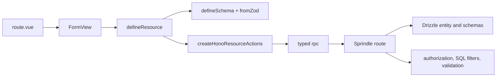

# Resource Form Configuration Guideline

- Status: Ready for written review
- Date: 2026-08-12
- Scope: Current `apps/web` resource forms and their `apps/api` contracts

## Objective

Create one repo-local skill named `build-resource-form`. The skill will be the
current source of truth for configuring resource forms in this repository. It
will guide an implementer through frontend field configuration, backend route
contracts, standard list and detail data sources, custom workflow forms, child
data, and verification.

The skill will use current repository terms and patterns only. It will not
contain historical implementation details or comparison instructions.

## Scope

The skill will cover:

- standard create and update resource forms;
- schema-bound field catalogs and ordered field references;
- field renderers and their common configuration;
- field sources backed by standard list and detail actions;
- dependent fields and reset rules;
- terminal field overrides for action-specific behavior;
- file, image, location, multi-value, and custom form fields;
- custom resource actions and route-owned workflows;
- parent and child data form contracts;
- API authorization, validation, filtering, sorting, pagination, and detail
  loading; and
- focused tests and browser verification.

The skill will not change framework package code. If the framework has no
matching surface, the implementer will record the exact gap and keep the
smallest route-local implementation.

## Architecture



The default implementation path is:

1. Read the nearest route, schema, resource, actions, API route, entity, and
   focused tests.
2. Define the record, query, create, and update contract with `defineSchema`.
3. Define shared field references with `defineFields`.
4. Bind ordered field references to the standard resource actions.
5. Expose the required API actions and validate them at the server boundary.
6. Use `FormView` for standard create and update screens.
7. Verify the form in focused tests and in the real route when available.

## Frontend rules

Use `defineSchema` for the resource contract. Use `fromZod(schema)` when a
runtime schema supplies validation and parsed output. Do not add a second type
parameter to the schema bridge.

Use `defineFields(schema, definitions)` for field references. Keep these values
in the field catalog:

- labels;
- `read` and `write` mapping;
- display, table, detail, and form projections;
- renderers and static option sources; and
- pure form behavior.

Select fields in their visible order inside each standard action:

```ts
const fields = defineFields(schema, {
  name: { label: 'Name', form: { renderer: 'text' } },
  status: { label: 'Status', form: { renderer: 'radio', source: statusOptions } },
})

const resource = defineResource(schema, {
  key: 'records',
  actions: {
    create: { run: actions.create, fields: [fields.name, fields.status] },
    update: { run: actions.update, fields: [fields.name, fields.status] },
  },
})
```

Use the standard view shells:

```vue
<FormView v-bind="resource.create()" title="Create record" />
<FormView v-bind="resource.update({ id })" title="Edit record" />
```

Use pure behavior functions for dependent fields:

- `visible` controls field presence and submitted visibility;
- `disabled` controls input state;
- `props` adds values such as parent IDs to a field source;
- `resetWhen` clears a child value when its parent changes; and
- `derived` computes a value that the user does not edit.

Use a terminal field override when one action needs a local change:

```ts
const updateFields = [
  fields.name,
  fields.status.override({ form: { behavior: { disabled: () => true } } }),
]
```

Do not chain overrides or create a second catalog for one action.

Import the owner resource as the field `source`. Do not add
`/<consumer>/create-options/*`. Do not use `/lookup`. Pass parent values,
search values, and other source parameters through `searchParameters`. Do
not redeclare the owner query. The source must provide a paginated list and
a detail action. Keep filtering and relationship rules on the server. API
list and detail use `list-*` / `detail-*`. Resource `permission` stays
`view-*` for the admin screen.

Use a small static array only for a closed value set that belongs to the form
contract, such as a status or category code.

Use `read` and `write` when the displayed value and submitted value differ.
Examples include relation labels, retained upload keys, location objects, and
multi-value selections.

Use `initialData` for fixed parent values in a form. Use `context` for stable
screen information that affects field behavior. Keep navigation, confirmation,
dialogs, toasts, and custom post-submit work in the route.

## Backend rules

Define runtime schemas for the record and every standard write input. Expose
only the actions required by the resource.

Every API route must:

- authenticate the caller;
- apply the required permission and organization or project scope;
- parse known query or body values;
- validate references, active state, parent relationships, and workflow state;
- apply list filters, search, stable sorting, `limit`, and `offset` in SQL;
- use the same conditions for the list and count queries; and
- return only fields required by the consuming surface.

Use these response shapes:

```ts
// list
{ data, page, limit, total }

// detail and successful create or update
{ data: record }
```

Give each resource-backed field source a standard list action and a detail
action. The list action must support the query values used by the field. The
detail action must read one authorized record so an existing form value can
load its display data without loading a full collection.

Repeat all important checks on create and update. A valid option response does
not make a submitted ID trusted.

For custom workflow actions, define a separate input schema and endpoint when
the action has a different permission, state transition, transaction, or
response. The server remains authoritative for each transition.

## Custom workflows and child data

Use standard resource actions for ordinary entity CRUD. Use route-owned
composition for forms with workflow branches, child records, or several
independent writes.

- Use a custom resource action for a domain operation.
- Use `Form`, `Table`, `DialogForm`, and registered framework inputs for custom
  surfaces.
- Keep workflow controls and post-action refresh in the route.
- Use one transaction when a parent and its submitted child records must be
  saved together.
- Give a persistent child collection its own resource and standard list/detail
  contract when it has independent screens or actions.
- Keep a child form route-local when it exists only as part of one parent
  workflow.

Do not create a generic workflow engine for one module. Keep the smallest
explicit action and transaction code that expresses the domain rules.

## Field reference

Add `references/form-field-types.md` with one compact entry for every current
form renderer registered by the web application. Each entry will show:

- minimal configuration;
- value and schema shape;
- required and common props;
- static source or standard list resource source;
- `read` and `write` mapping when needed;
- behavior examples; and
- one current application usage.

Add advanced entries for files, images, locations, rich text, multi-value
fields, and custom child-form surfaces. Keep this file as a pattern guide, not
a duplicate of framework API documentation.

## Verification

For each form change, run the smallest useful checks:

- resource test for field order, renderer, source, behavior, and overrides;
- action test for query forwarding and input mapping;
- API test for authorization, validation, filtering, sorting, pagination, and
  detail access;
- web type check and focused lint;
- `git diff --check`; and
- browser create or edit verification when the route is available.

For a real form, confirm that:

1. opening a field source calls its standard list endpoint;
2. the request contains page, limit, search, and required dependency values;
3. changing search sends a new server request;
4. returned records are already scoped and filtered; and
5. editing loads selected values through detail requests.

The final report will state `Reused`, `Searched`, and `Gap` for each web
surface. A framework gap does not authorize a framework package change.

## Skill files

Create this structure:

```text
.agents/skills/build-resource-form/
├── SKILL.md
├── agents/openai.yaml
└── references/
    ├── backend-form-contract.md
    └── form-field-types.md
```

Keep `SKILL.md` procedural and below 500 lines. Load the references only when
the form needs detailed field or endpoint guidance.

## Non-goals

- Do not add application code for a sample module.
- Do not edit `packages/is-vue-framework`.
- Do not create compatibility wrappers or parallel form APIs.
- Do not add a new dependency.
- Do not add a script when the repository files already provide the needed
  patterns.
