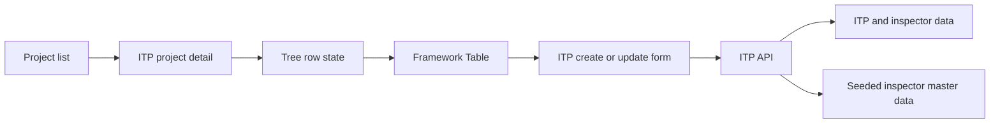

# ITP Setup Design

- **Status:** Approved
- **Date:** 2026-08-18
- **Scope:** Inspection & Test Plan setup
- **Legacy source:** `/Users/gamer/Documents/projects/ads-hk-legacy`

## Goal

Build the ITP setup flow in the new application. Keep the useful legacy
behavior and remove fields and flows that are not part of the approved scope.
Use the current application framework for standard surfaces.

This design does not migrate existing legacy ITP data. It does not add a
compatibility layer for the legacy database.

## Approved scope

The first slice includes:

- a project list;
- a project ITP detail screen;
- a recursive work-item tree shown through the framework `Table`;
- ITP rows for leaf work items;
- create, view, update, and soft delete;
- Material, Process, and Product ITP types;
- seeded inspector types and inspection points; and
- stable create, update, list, and delete contracts for future import and
  export.

The first slice does not include:

- Quality Inspection runtime;
- Excel import;
- Excel export;
- inspector type CRUD;
- inspection point CRUD;
- legacy ITP data migration;
- `material` and `product` fields from the legacy table; or
- changes to the framework package or the existing Work Items screen.

Do not add placeholder import, export, or migration code. The normal ITP
contracts and stable master-data codes are the preparation for later work.

## Legacy findings

The legacy flow is split into these parts:

- `frontend-ads-vuejs/src/views/authenticated/work-unit-inputs/work-item-itp/work-item-itp.vue`
  provides the separate Inspection & Test Plan screen.
- `frontend-ads-vuejs/src/views/authenticated/work-unit-inputs/work-item-itp/layouts/WorkItemITPDetailUnder.vue`
  loads the project work-item tree and displays ITP rows under leaf work
  items.
- `frontend-ads-vuejs/src/views/authenticated/work-unit-inputs/work-item-itp/layouts/layouts/ChildDataWorkItemITPInspectors.vue`
  loads the inspector dataset template for a new ITP row.
- `backend-ads-laravel/app/Models/WorkItemItp.php` and the related migrations
  define the ITP and inspector child records.
- `backend-ads-laravel/app/Services/WorkItemItpInspector/TemplateWorkItemItpInspector.php`
  returns active inspector types and active inspection points.

The legacy screen permits ITP creation only for leaf work items. Its active
form has these fields:

- type;
- criteria;
- procedure code;
- specification;
- method;
- frequency;
- inspector selections;
- work evidence image; and
- description.

The legacy model still contains `material` and `product`. The active form does
not write them. The export and import code also uses `type`, `criteria`,
`procedure_code`, `specification`, `method`, and `frequency`, not those two
fields. The new application removes both fields.

The legacy detail view passes `disabled` only to its read-only detail display.
The update `ModalForm` does not pass `disabled`, so inspector points are
editable during both create and update. The new application keeps that
behavior.

## Architecture

Use these boundaries:

1. The project route owns navigation, project selection, tree expansion,
   dialogs, toasts, and refresh after successful actions.
2. The ITP resource and schema own field definitions, labels, form validation,
   and standard create, update, and delete actions.
3. The API schema validates all input at the trust boundary.
4. The API verifies project access, leaf work-item ownership, active master
   data, permissions, type uniqueness, and active-state rules.
5. The database owns relations, active-row uniqueness, and child-row
   uniqueness.

The project list uses the existing project resource and project access rules.
The ITP detail route uses a custom action to load the recursive work-item tree
and its ITP rows.

## Web surface

### Project list

Use the framework project list surface. Keep the legacy project entry flow:

1. open the ITP screen;
2. select a project; and
3. open that project's ITP detail.

Keep the legacy project list fields and month filters where the existing
project resource supports them. Do not create a second project list model.

### Framework `Table`-backed tree-table

Use the framework `Table` as the actual table. Do not write a second native
`<table>` implementation and do not change the existing Work Items route.

The route-local tree layer will:

1. receive the nested work-item tree;
2. track expanded work-item IDs;
3. flatten the expanded tree into visible rows;
4. add ITP child rows below leaf work-item rows; and
5. pass the visible rows to the framework `Table`.

The framework `Table` owns the table structure, loading or empty states,
columns, column sizing, pagination behavior, and row actions. A table cell
slot renders the work-item path, depth indentation, expand/collapse control,
and tree connectors. The row-actions slot renders ITP actions.

The framework `Table` has cell and row-action slots but no native tree-row
contract. Tree state, flattening, and tree-cell rendering therefore remain in
the route-local ITP surface. This is the only intentional custom UI layer.

The table shows:

- work item;
- ITP type;
- criteria;
- procedure or code;
- specification;
- method;
- frequency; and
- row actions.

Only leaf work-item rows expose create actions. Existing ITP rows expose view,
edit, and delete actions according to permission. The table hides the create
action for a type that already has an active row.

### ITP form

Use the framework form surface. The form order is:

1. type;
2. criteria;
3. procedure code;
4. specification;
5. method;
6. frequency;
7. inspector selections;
8. work evidence image; and
9. description.

The type input is a required radio input with these values:

- `material` — Material;
- `process` — Process; and
- `product` — Product.

The inspector grid is a route-local domain input. It shows every active
inspector type and every active inspection point. Users can check or uncheck
any point during create and update. No selected point is required.

## Data model

Use the current application database naming conventions. The logical records
are:

### ITP record

- `id`
- `workItemId`
- `type`
- `criteria` (nullable)
- `procedureCode` (nullable)
- `specification` (nullable)
- `method` (nullable)
- `frequency`
- `imgDocumentation` (nullable)
- `description` (nullable)
- audit fields
- `active`

Do not store `projectId` on the ITP record when the work item already owns the
project relation. The API derives and verifies the project from the work item.

### ITP inspector record

Each ITP record has one child record for each active inspector type included by
the dataset template.

- `id`
- `itpId`
- `inspectorTypeId`
- audit fields
- `active`

### ITP inspector point record

Each inspector record has one child record for each active inspection point.
The point code is the stable master-data key.

- `id`
- `itpInspectorId`
- `inspectionPointCode`
- `value` (boolean, default `false`)
- audit fields
- `active`

Enforce unique `(itpInspectorId, inspectionPointCode)`.

### Master data

Seed these active inspector types:

| Code or legacy ID | Name |
| --- | --- |
| `SC` | SubCon |
| `HK` | HK |
| `CONS` | Konsultan |
| `OWN` | Owner |
| `AUTH` | Authority |

Seed these active inspection points:

| Code | Name |
| --- | --- |
| `P` | Perform |
| `R` | Record |
| `W` | Witness |
| `SW` | Spot Witness |
| `S` | Surveillance |
| `H` | Hold Point |

The exact seeded display labels must match the approved legacy values. There
is no master-data administration screen in this slice.

## Field rules

The API and database enforce these rules:

| Field | Rule |
| --- | --- |
| `type` | Required enum: `material`, `process`, or `product` |
| `criteria` | Optional |
| `procedureCode` | Optional |
| `specification` | Optional |
| `method` | Optional |
| `frequency` | Required integer, minimum `1` |
| `imgDocumentation` | Optional image or file reference |
| `description` | Optional, maximum 255 characters |
| inspector points | Optional; zero selected points is valid |

The server rejects inactive or unknown inspector types and inspection point
codes. It also rejects an ITP record for a non-leaf work item or for a work
item outside the selected project.

## Cardinality and lifecycle

There is at most one active ITP record for each `(workItemId, type)` pair.
Enforce this in the database with an active-row unique constraint or its
equivalent. The API also returns a clear conflict error for a duplicate create
or update.

Users may change a record's type during update only when the destination type
has no active record for that work item. The database remains the final guard
against a race.

Delete is a soft delete. Inactive rows do not appear in normal list or tree
queries. A later create may use the same work item and type after deletion.
Existing audit and child records remain recoverable by the normal active-state
rules.

The new application starts with new ITP data only. It does not merge or
collapse duplicate legacy records.

## API contract

The API provides these logical operations:

- list the accessible projects for the ITP screen;
- load the recursive work-item tree and active ITP rows for one project;
- load the inspector dataset template for a new ITP record;
- create one ITP record and its inspector child grid;
- update one ITP record and its inspector child grid; and
- soft delete one ITP record.

The tree action returns enough data for the route to render work-item depth,
leaf status, existing ITP rows, and active type availability. The route does
not infer whether a work item is a leaf from a partial list.

Create and update use the same row contract. The server derives the project
from the work item and does not trust a client-only project relation.

Future import and export will map to the same row fields, type values, stable
point codes, and one-row-per-type rule. No import or export route is included
now.

## Authorization

Keep the legacy ITP write permissions:

- `create-work-item-itp`;
- `update-work-item-itp`; and
- `delete-work-item-itp`.

Project list and work-item access use the existing application access rules.
The API checks the permission and project scope again for every write. Client
permission checks only hide unavailable actions.

There is no separate inspector master-data permission in this slice because
there is no master-data CRUD screen.

## Acceptance criteria

The design is complete when the implementation can demonstrate:

- a user selects an accessible project from the ITP project list;
- the detail route renders the nested work-item tree through the framework
  `Table`;
- the table supports expand/collapse, depth indentation, and tree connectors;
- only leaf work items expose ITP creation;
- one active row exists per leaf and type;
- duplicate active creates and occupied type changes fail at the API boundary;
- frequency rejects missing, zero, negative, and non-integer values;
- optional text fields and the image can be empty;
- all seeded inspector types and points appear in a new form;
- an ITP row can save with no selected inspection points;
- inspector points remain editable during update;
- delete hides the row and permits a new row for the same type;
- inactive master data cannot be selected; and
- no Quality Inspection, import, export, or legacy migration behavior is
  introduced.

## Framework reuse record

**Reused:** framework `Table`, cell slots, row-actions slot, framework form,
project resource, existing authentication, project access, and upload
services.

**Searched:** `packages/is-vue-framework/src/components/core/Table.vue`,
`TableContent.vue`, the framework README, the current project and work-item
resources, and the current web architecture guide.

**Gap:** the framework `Table` has no native tree-row or tree-group contract.
The ITP route will own only tree expansion, flattening, and the tree cell
renderer. Do not modify the framework package for this feature.
