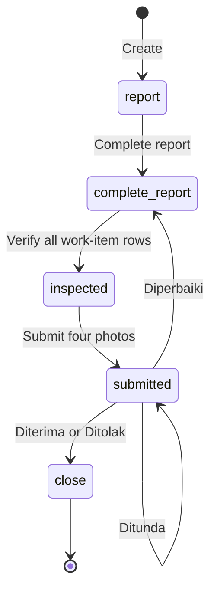
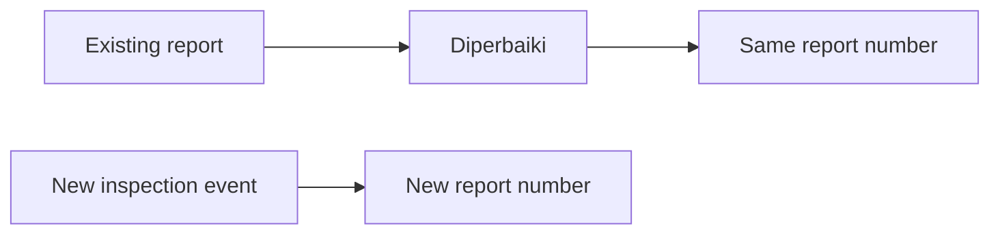
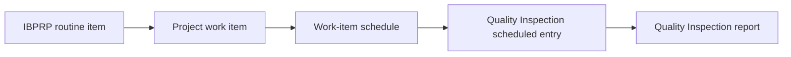

# Quality Inspection Design

- **Status:** Approved
- **Date:** 2026-08-18
- **Scope:** Quality Inspection runtime in the new application
- **Legacy source:** `/Users/gamer/Documents/projects/ads-hk-legacy`

## Goal

Build Quality Inspection in the new application. Use the legacy application as
the default business rule. Keep the approved improvements in this document.

The current application has no Quality Inspection data to migrate. The legacy
repository is a behavior reference only. Do not build a legacy compatibility
layer or a Quality Inspection data migration.

The approved ITP Setup design is a fixed dependency:

`docs/superpowers/specs/2026-08-18-itp-setup-design.md`

Quality Inspection may read ITP Setup data. It must not change the ITP Setup
scope unless a separate decision approves that change.

## Scope

The first Quality Inspection slice includes:

- manual report creation;
- scheduled report creation from the scheduled work-item entry point;
- one report with many selected leaf work items;
- one row for each selected leaf work item;
- selected ITP data copied into an immutable report snapshot;
- report completion, item verification, documentation submission, and final
  verification;
- the four fixed photo slots used by the legacy application;
- automatic PTS creation and reuse for rejected work-item rows;
- report and item verification history;
- legacy labels, statuses, result codes, and action permissions; and
- the closed-report evidence export.

This slice does not include:

- migration of legacy Quality Inspection records;
- an IBPRP module;
- a `qhsse-control-plan` module;
- a new Todo or notification architecture; or
- inspector master-data administration.

## Settled principles

1. Preserve legacy behavior unless this document marks an approved
   improvement.
2. Keep duplicate reports. A work item can appear in many reports, including
   reports that overlap in time and reports that are open at the same time.
3. Treat each report as an inspection event at a point in time. Do not replace
   an earlier report when a later inspection gives a different result.
4. Keep the PTS workflow separate from the Quality Inspection workflow.
5. Enforce all business rules in the API. The UI is not a security boundary.
6. Use the current application framework for standard list, detail, and form
   surfaces. Keep only the selector, fixed photo form, and workflow actions
   route-local.

## Verified legacy process

### Quality Inspection flow

The stored step codes are:

| Step code | Legacy label | Meaning |
| --- | --- | --- |
| `report` | `Dilaporkan` | The report exists and needs procedure details. |
| `complete-report` | `Laporan Terlengkapi` | Procedure details are complete. Item verification is available. |
| `inspected` | `Terinspeksi` | All work-item rows have a result. The four photo slots are available. |
| `submitted` | `Dokumentasi Terlengkapi` | The four photo slots are complete. Final verification is available. |
| `close` | `Terverifikasi` | The report is final. |

The stored status codes are `open`, `on-progress`, and `close`.

### Report results

Keep the legacy result codes and labels exactly:

| Result code | Legacy label | Behavior |
| --- | --- | --- |
| `approved` | `Diterima` | Set the report to `close`. |
| `rejected` | `Ditolak` | Set the report to `close`. This does not create an automatic PTS. |
| `repair` | `Diperbaiki` | Keep the same report number, set all item rows to `waiting`, and return to `complete-report`. |
| `pending` | `Ditunda` | Keep the report at `submitted` with status `on-progress`. Final verification remains available. |

`pending` is not a separate form or a PTS disposition. It is a temporary
report result.

The final result is independent of the item results. Keep the legacy behavior:
a report may have a rejected item row and still receive the final result
`approved`.

### New report versus repair

`Diperbaiki` is another verification cycle for the same report. It keeps the
same report number and report identity.

A new report is a new inspection event. Users create it manually, including
after a PTS is repaired or closed. This also applies when a different
inspector disagrees with an earlier result or when a later condition makes an
earlier pass no longer true. The system does not create a follow-up Quality
Inspection automatically.

## Creation

### Entry points

Keep both legacy entry points:

1. the scheduled work-item action; and
2. the normal Quality Inspection create screen.

The scheduled entry point pre-fills the division, project, and scheduled
work-item category. It keeps the normal leaf-work-item selector. It does not
provide another source for `Target Pelaksanaan`.

The normal create screen has no schedule reference.

### Report fields

Use the legacy fields and labels:

- `Divisi` (`divisionId`);
- `Proyek` (`projectId`);
- `Target Pelaksanaan` (`targetDate`), required;
- `Kategori Pekerjaan` (`qualityWorkCategoryId`), required;
- `Jenis Pekerjaan` (`workItemCategoryId`), required;
- `Area/Zona Kerja` (`locationZone`); and
- selected work-item rows.

`Target Pelaksanaan` is the planned target date. It is independent of the
optional schedule-period snapshot. `createdAt` and `createdBy` identify the
actual report event.

### Work-item selection

The selector shows the work-item tree and allows selection only for leaf work
items that have active ITP data.

Each selected leaf row contains:

- the work item;
- a strictly positive `volume`; and
- one or more selected ITP types.

The report must contain at least one selected leaf work item.

Each leaf work item can appear at most once in one report. Enforce this in the
API and database with unique `(qualityInspectionId, workItemId)`.

There is no unique rule across reports. The same work item can appear in many
reports, in the same schedule period, and in multiple open reports.

### ITP selection and snapshot

For each selected leaf work item, require at least one ITP type. Keep the
legacy type values:

- `material`;
- `process`; and
- `product`.

At report creation, copy the selected ITP data into the report. Store the
source ITP record ID for traceability. Copy the values needed to show the
criteria used by the inspection:

- type;
- criteria;
- procedure code;
- specification;
- method;
- frequency;
- inspector selections;
- work evidence image; and
- description.

The snapshot is immutable after creation. Later ITP Setup changes affect new
reports only.

The report has one combined verification result per leaf work-item row, even
when that row has more than one selected ITP type. The selected type criteria
are evidence for that combined result.

### Scheduled origin

For a scheduled report, store:

- the originating work-item schedule ID; and
- a copy of the schedule start and end dates.

The schedule reference is optional. A manual report has no schedule reference.
The date snapshot keeps the original period when the schedule changes later.

The schedule reference does not make reports unique. It is traceability data.

## Workflow actions and permissions

Keep CRUD permissions separate from workflow permissions.

### CRUD permissions

- `create-quality-inspection`;
- `view-quality-inspection`;
- `show-quality-inspection`;
- `update-quality-inspection`; and
- `delete-quality-inspection`.

### Workflow permissions

- `complete-report-quality-inspection`;
- `verify-quality-inspection-work-item-itp`;
- `submit-quality-inspection-documentations`; and
- `verify-quality-inspection`.

Each permission is checked on the server. The server also checks the current
step before it accepts the action:

| Action | Required step | New step |
| --- | --- | --- |
| Complete report | `report` | `complete-report` |
| Verify one work-item row | `complete-report` | `complete-report`, or `inspected` after the last row |
| Submit documentation | `inspected` | `submitted` |
| Final verification | `submitted` | `close`, `complete-report`, or `submitted` depending on result |

The same user may perform more than one action when that user has the required
permissions. Do not add a same-user or different-user restriction.

ITP inspector assignments are reference data only. Do not require the current
user to match an assigned inspector type. Record the actual user and time for
each verification event.

## Report completion

The complete-report action requires:

- `inspectionPointCode` (`Inspection Point`); and
- `workMethod` (`Prosedur / Metode Kerja`).

The action sets the report status to `on-progress` and the step to
`complete-report`.

## Work-item verification

Each work-item row starts with status `waiting`. The verifier can choose only:

- `approved`; or
- `rejected`.

The verification description is optional for both results. Store the current
result on the item row and append an immutable verification event containing:

- the result;
- the optional description;
- the acting user; and
- the event time.

When all rows have a result, set the report step to `inspected` and create the
four fixed documentation slots if they do not already exist.

If the item result is `rejected`, create or reuse the linked PTS as described
below.

## PTS behavior

### Two different result paths

The Quality Inspection result `rejected` and a PTS revision request are
different events:

1. A Quality Inspection verifier can mark a work-item row `rejected`. This is
   the event that creates an automatic PTS in legacy.
2. A PTS user can request repair or revision inside the existing PTS. This
   does not create another PTS.

In the PTS UI, the disposition `repair` is labelled `Diperbaiki`. Later,
implementation verification uses an internal `rejected` code but labels the
action `Perbaikan Ulang`. Both paths keep the same PTS record and continue its
workflow.

### Automatic PTS from a rejected item

When a work-item row is rejected:

1. Find the unfinished or open PTS linked to that inspection item.
2. Reuse it when it exists.
3. Otherwise create one PTS with the legacy source marker `qi-report`.
4. Store the rejection note, work item, project, report, and item relation.
5. Append a rejection event with the report, item, user, time, and note.

The PTS operation and the item verification operation are one transaction.
Do not save a rejected result without its PTS relation when PTS creation or
reuse fails.

Legacy creates another PTS when the same Quality Inspection work-item row is
rejected again after the Quality Inspection report is repaired. It does not
search for an existing PTS. The new application improves only this
Quality-Inspection-to-PTS boundary: reuse one unfinished or open PTS and record
the repeated rejection event. After that PTS is closed, a later rejected
inspection can create a new PTS.

The first PTS is not closed automatically when the Quality Inspection report
is repaired. Therefore, the first and second PTS can both remain open. This is
not a PTS revision request. It is duplicate PTS creation caused by the legacy
Quality Inspection service. Multiple open Quality Inspection reports for the
same work item can create the same problem. The new open-PTS reuse rule must
prevent both cases.

The PTS remains an independent workflow. A later `Diterima` Quality Inspection
does not close the PTS. The PTS closes through its own workflow.

### Manual PTS

The manual PTS path remains separate. Its `complete-qi-report` action completes
the PTS report created from a Quality Inspection; it does not create a new
Quality Inspection.

Keep the existing PTS disposition labels:

- `Tetap Dipakai`;
- `Diperbaiki`;
- `Diturunkan Mutu (dengan persetujuan pengguna jasa)`; and
- `Dibongkar dan Dikerjakan Ulang`.

### Report-level rejection

The final result `Ditolak` does not create an automatic PTS. A user can create
a manual PTS when the report-level rejection needs a corrective-action record.

## Documentation

After all work-item rows have a result, create exactly these four fixed slots
with the legacy names:

- `sudut 1`;
- `sudut 2`;
- `sudut 3`; and
- `sudut 4`.

All four image files are required. Each description is optional. The submit
action must reject an incomplete set.

After successful submission, set the report step to `submitted` and status to
`on-progress`.

## Final verification

Final verification is available only at `submitted` and presents the four
legacy results:

- `Diterima` (`approved`);
- `Ditolak` (`rejected`);
- `Diperbaiki` (`repair`); and
- `Ditunda` (`pending`).

The final description rule is:

- `Diterima`: description optional;
- `Ditolak`: description required;
- `Diperbaiki`: description required; and
- `Ditunda`: description required.

Store the current result and append an immutable report-result event for every
final verification action. The event contains the result, description, user,
time, and resulting step/status.

## Edit and delete rules

Generic report edits are allowed only while the report is at `report`.
After the report moves to `complete-report`, use only the workflow actions.
This includes the parent report and all child snapshot rows.

Soft delete is allowed only while the report is at `report`. Do not delete or
edit a report after the workflow starts. A deleted report is excluded from all
future report queries.

Do not add a cancel workflow in this slice. A report created by mistake can be
soft-deleted before completion.

## History and audit

Keep current values for fast display and keep immutable event records for
history.

The history must show:

- every work-item verification result;
- every report-level result;
- every repair cycle;
- every repeated PTS rejection; and
- the acting user and event time.

The history must show an example sequence such as:

`Diterima by Inspector A -> Diperbaiki -> Ditolak by Inspector B`.

Do not use a later result to remove or rewrite an earlier event.

## IBPRP and control-plan relationship

The legacy relationship is indirect:

The legacy Quality Inspection record does not have a direct IBPRP relation.
`qhsse-control-plan` shows work-item schedules and IBPRP risk and preventive
action data. Quality Inspection is connected through the scheduled work item,
not directly to an IBPRP row.

The new Quality Inspection stores the optional schedule reference and period
snapshot. It does not add a direct `ibprpId` field.

> **TODO — deferred:** define scheduled-todo completion and notification
> behavior when the Todo and notifications architecture is available. The
> Quality Inspection slice stores schedule origin data but does not implement
> todo state or notification behavior. The legacy rule that any created report
> completes a scheduled todo is not carried into this slice until that
> architecture is designed.

## Web surface

Use the new application framework for the standard surfaces:

- `ListView` for report lists;
- `DetailView` for report details;
- `FormView` for report creation and the generic report edit available at
  `report`; and
- framework table/detail/form components for standard fields.

Use route-local workflow surfaces for:

- the recursive leaf work-item selector;
- the selected item and ITP snapshot table;
- the fixed four-slot photo form; and
- the four workflow actions.

The report detail shows:

- report number and legacy status labels;
- report fields and target date;
- schedule origin and period when present;
- selected work items and volume;
- the selected ITP snapshot criteria;
- current item results and verification history;
- linked PTS status and rejection history;
- the four photo slots; and
- the report-result history.

Keep the legacy evidence export for closed reports. Do not add a new report
label or rename the result choices.

## Backend rules

The API must enforce these rules in one transaction per action:

1. The user has the required CRUD or workflow permission.
2. The report belongs to the selected project and division.
3. The report is at the required step.
4. A report has at least one selected leaf work item.
5. Each selected work item has a positive volume.
6. Each selected work item has at least one selected ITP type.
7. A leaf work item occurs at most once in one report.
8. Selected ITP records are active and belong to the selected work item at
   report creation.
9. The report snapshot is not replaced by later ITP changes.
10. All four documentation slots contain an image before submission.
11. Final descriptions follow the result-specific rule.
12. Generic edits and soft deletes follow the report-step guard.
13. Rejected item verification and PTS create/reuse commit together.

Use database constraints for relations and the per-report work-item unique
rule. Use application validation for workflow and ITP snapshot rules.

## Approved differences from legacy

These changes are deliberate:

| Area | Legacy behavior | New decision |
| --- | --- | --- |
| ITP data | Existing reports read live ITP data. | Copy selected ITP data at report creation and store source IDs. |
| ITP types | A selected item can have no type. | Require at least one type. |
| Volume | The server accepts zero or negative numeric values. | Require a positive volume. |
| PTS repeat rejection | Each rejection creates a new PTS. | Reuse one unfinished/open linked PTS and record the new rejection event. |
| Generic edit | Generic edit can change a report at any step. | Allow generic edit only at `report`. |
| Generic delete | Soft delete is available at any step. | Allow soft delete only at `report`. |
| Verification history | Current values are overwritten. | Keep immutable item and report-result events. |
| Schedule traceability | The todo uses an indirect work-item/date lookup. | Store the optional schedule ID and period snapshot. |
| Item verification note | The legacy UI requires it but the backend allows null. | Optional in both UI and API. |
| Final description | The legacy UI and backend require it for every result. | Optional only for `Diterima`; required for all other results. |

All other behavior remains aligned with the legacy system.

## Legacy evidence

The design was checked against these legacy areas:

- `frontend-ads-vuejs/src/app/configs/quality-inspection.ts`;
- `frontend-ads-vuejs/src/views/authenticated/work-unit-inputs/quality-inspection/`;
- `backend-ads-laravel/app/Models/QualityInspection.php`;
- `backend-ads-laravel/app/Models/QualityInspectionWorkItemItp.php`;
- `backend-ads-laravel/app/Services/QualityInspection/CompleteReportQualityInspection.php`;
- `backend-ads-laravel/app/Services/QualityInspection/VerifyQualityInspection.php`;
- `backend-ads-laravel/app/Services/QualityInspectionWorkItemItp/VerifyQualityInspectionWorkItemItp.php`;
- `backend-ads-laravel/app/Services/QualityInspectionDocumentations/SubmitQualityInspectionDocumentations.php`;
- `backend-ads-laravel/app/Services/QhssePts/CompleteQiQhssePts.php`;
- `backend-ads-laravel/app/Models/WorkItemSchedule.php`;
- `backend-ads-laravel/app/Services/Todo/ListTodo.php`;
- `backend-ads-laravel/app/Services/Dashboard/DashboardSafetyControlPlan.php`; and
- `frontend-ads-vuejs/src/app/configs/qhsse-control-plan.ts`.

## Completion criteria

The design is complete when implementation can demonstrate:

- both creation entry points;
- multiple leaf work items in one report;
- duplicate reports for the same work item, including open duplicates;
- ITP snapshots that do not change after ITP Setup edits;
- all four legacy workflow actions and result labels;
- the approved description rules;
- four required photo slots with optional descriptions;
- PTS create/reuse and rejection history;
- same-number repair cycles and new numbers for new inspections;
- independent PTS closure;
- report and item history;
- report-step edit/delete guards;
- optional scheduled origin with date snapshot;
- no legacy data migration; and
- no Todo or notification behavior until the deferred architecture exists.
