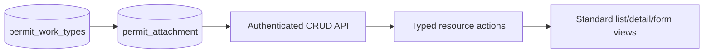

# Permit Attachment Design

- **Status:** Design approved in chat; written-spec review pending
- **Date:** 2026-08-19
- **Scope:** The `permit-attachment` master data module
- **Legacy source:** `/Users/gamer/Documents/projects/ads-hk-legacy`

## Goal

Add the legacy-backed permit document checklist master data screen with the
current ADS-HK standard CRUD API and resource surfaces. Preserve the legacy
visible labels, values, optional work-type relation, active-state behavior,
audit fields, and delete behavior.

## Legacy contract

The legacy config is
`frontend-ads-vuejs/src/app/configs/permit-attachment.ts`:

- Page title: `Checklist Dokumen`
- Visible fields: `name`, `description`, `active`
- Menu key: `permit-attachment`
- Menu title: `Checklist Dokumen`

The legacy table is `permit_attachment`. It has `id`, `name`, nullable unique
`code`, nullable `description`, `active` with default `true`, optional
`permit_work_type_id`, creator/updater IDs, and timestamps. The work-type
foreign key cascades on work-type delete.

### Field matrix

| Field | Label | Create | Update | List/detail | Form control | Source |
| --- | --- | --- | --- | --- | --- | --- |
| `name` | `Nama` | required | editable | visible | text input | user |
| `description` | `Deskripsi` | optional | editable | visible | textarea | user |
| `active` | `Status` | default `true` | editable | visible | radio: `Aktif`, `Tidak Aktif` | user |
| `code` | `Kode` | optional nullable | editable | hidden | none | API only |
| `permitWorkTypeId` | legacy relation | optional | fixed/hidden | hidden | none | API/seed only |
| audit fields | legacy audit labels | server only | server only | hidden | none | authenticated user/time |

The optional work-type relation is kept in the data and API contract because
legacy uses it for seeded records. The legacy screen hides it, so the new
screen also hides it. Do not add a work-type lookup to this CRUD form.

The legacy attachment lookup currently returns active rows with
`permit_work_type_id` set to `null`; the module implementation does not add a
new lookup endpoint.

## Ownership and data flow

- API files belong in `apps/api/src/routes/permit-attachment/`.
- Web files belong beside the route in
  `apps/web/src/routes/(authenticated)/master-data/permit-attachment/`.
- Register the API domain and installed routes through the existing route
  registry. Add the module to the system authorization catalog and seeded
  role permissions.
- Reuse `defineResource`, `ListView`, `DetailView`, and `FormView`. Do not add
  framework code or a local generic CRUD component.

## Routes and actions

Web routes:

- `/master-data/permit-attachment`
- `/master-data/permit-attachment/create`
- `/master-data/permit-attachment/:permitAttachmentId/detail`
- `/master-data/permit-attachment/:permitAttachmentId/edit`

Use standard list, detail, create, update, and delete actions. Use the current
permission names:

- `view-permit-attachment`
- `list-permit-attachment`
- `detail-permit-attachment`
- `create-permit-attachment`
- `update-permit-attachment`
- `delete-permit-attachment`

Add the menu entry under the legacy `Work Permit` separator with the exact
label `Checklist Dokumen`.

## Validation and delete behavior

- Trim `name` and reject an empty value.
- Validate nullable `code` as unique when supplied.
- Validate nullable `permitWorkTypeId` against `permit_work_types` when an API
  client supplies it.
- Validate `active` as a boolean and default it to `true` on create.
- Set audit fields from the authenticated user and current time.
- Deleting a work type cascades linked attachments. Attachment delete follows
  the repository standard delete behavior.

## Seed data

Extend the existing idempotent API seed flow with the 20 legacy rows. Keep
names and active states exact. The first ten rows have the following
`permitWorkTypeId` links, using the seeded work type identities:

| Name | Work type |
| --- | --- |
| `Checklist Hot Work` | `Hot Work` |
| `Checklist Electrical` | `Electrical` |
| `Checklist Cold Work` | `Cold Work` |
| `Checklist Demolition` | `Demolition` |
| `Checklist Working At Height` | `Working At Height` |
| `Checklist Confined Space Entry` | `Confined Space Entry` |
| `Checklist Gas Test` | `Confined Space Entry` |
| `Checklist Excavation` | `Excavation` |
| `Checklist Work Over Water` | `Excavation` |
| `Checklist Radiography` | `Radiography` |

The remaining ten rows have no work-type link:

1. `CSA/JSA/AKK` — inactive
2. `Metode Kerja`
3. `Rigging/Lifting Plan`
4. `Rescue Plan`
5. `MSDS`
6. `Checklist Operator/Lisensi`
7. `Drawing Area Activity`
8. `Shop Drawing`
9. `LOTO`
10. `Checklist Kerja`

All rows not marked inactive are active. Seed records by stable legacy
identity so a repeat run updates the same rows and does not create duplicates.

## Verification contract

- API tests cover list, detail, create, update, delete, relation validation,
  permission checks, and work-type cascade behavior.
- Web tests cover field keys, exact labels, hidden relation behavior, active
  options, resource actions, and route registration.
- Run focused type, lint, and test checks for the API and web packages.
- Use seeded data in an authenticated T3 preview to verify list, detail,
  create, edit, delete, permission visibility, exact labels, and that the
  screen has no work-type lookup field.
- Run `$verify-ads-hk-module` after implementation. Do not mark this module
  complete before the verifier returns `PASS`.

## Exclusions

- No new attachment lookup endpoint is required.
- No visible code or work-type field is required.
- No framework package change, backward-compatibility adapter, or unrelated
  master data change is part of this module.
