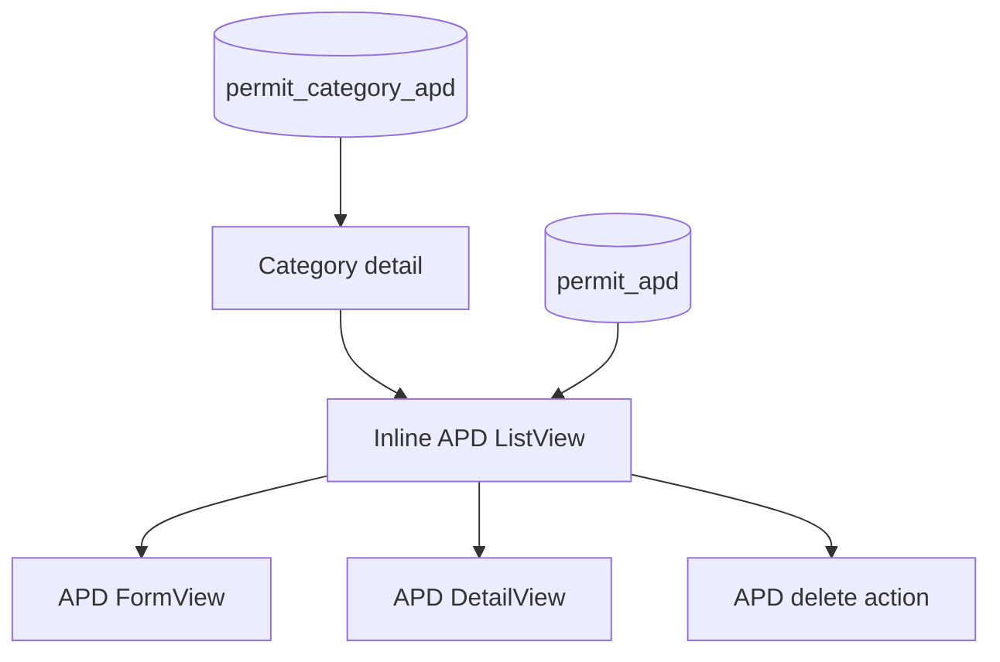

# Permit Category APD Design

- **Status:** Design approved in chat; written-spec review pending
- **Date:** 2026-08-19
- **Scope:** The `permit-category-apd` master data module and its nested
  `permit-apd` child records
- **Legacy source:** `/Users/gamer/Documents/projects/ads-hk-legacy`

## Goal

Add the legacy-backed personal protective equipment category master data
screen, including its nested APD CRUD, with the current ADS-HK standard API
and resource surfaces. Preserve the legacy titles, labels, values, relation,
active-state behavior, audit fields, and nested layout.

## Legacy contract

The legacy parent config is
`frontend-ads-vuejs/src/app/configs/permit-category-apd.ts`:

- Parent page title: `Kategori APD`
- Parent visible fields: `name`, `description`, `active`
- Parent menu key: `permit-category-apd`
- Parent menu title: `APD`

The legacy child config is `frontend-ads-vuejs/src/app/configs/permit-apd.ts`:

- Child title: `APD`
- Child visible fields: `name`, `description`, `active`
- Child records are filtered by the selected category and created with that
  category ID.
- The child CRUD is shown inline under the parent detail page.

The parent table is `permit_category_apd`. The child table is `permit_apd`.
Both have `id`, `name`, nullable unique `code`, nullable `description`,
`active` with default `true`, creator/updater IDs, and timestamps. A child
requires `permit_category_apd_id`. The child category foreign key has no
cascade rule in the legacy migration.

### Parent field matrix

| Field | Label | Create | Update | List/detail | Form control | Source |
| --- | --- | --- | --- | --- | --- | --- |
| `name` | `Nama` | required | editable | visible | text input | user |
| `description` | `Deskripsi` | optional | editable | visible | textarea | user |
| `active` | `Status` | default `true` | editable | visible | radio: `Aktif`, `Tidak Aktif` | user |
| `code` | `Kode` | optional nullable | editable | hidden | none | API only |
| audit fields | legacy audit labels | server only | server only | hidden | none | authenticated user/time |

### Child field matrix

| Field | Label | Create | Update | List/detail | Form control | Source |
| --- | --- | --- | --- | --- | --- | --- |
| `name` | `Nama` | required | editable | visible | text input | user |
| `description` | `Deskripsi` | optional | editable | visible | textarea | user |
| `active` | `Status` | default `true` | editable | visible | radio: `Aktif`, `Tidak Aktif` | user |
| `permitCategoryApdId` | legacy relation | route required | fixed/hidden | hidden | none | parent route |
| `code` | `Kode` | optional nullable | editable | hidden | none | API only |
| audit fields | legacy audit labels | server only | server only | hidden | none | authenticated user/time |

The parent and child screens do not expose `code` or the parent ID as user
fields. The child route supplies the parent ID.

## Ownership and data flow

- Parent API files belong in `apps/api/src/routes/permit-category-apd/`.
- Child API files belong in `apps/api/src/routes/permit-apd/`.
- Parent web files belong beside the route in
  `apps/web/src/routes/(authenticated)/master-data/permit-category-apd/`.
- Child resource and nested route files belong under the same parent route
  directory. The child has no standalone navigation entry.
- Register both API domains and installed routes through the existing route
  registry. Add both permission modules to the system authorization catalog
  and seeded role permissions.
- Reuse standard `ListView`, `DetailView`, and `FormView`. The parent detail
  uses the existing nested-resource pattern for the child `APD` list and
  actions. Do not add framework code or a local generic CRUD component.

## Routes and actions

Parent web routes:

- `/master-data/permit-category-apd`
- `/master-data/permit-category-apd/create`
- `/master-data/permit-category-apd/:permitCategoryApdId/detail`
- `/master-data/permit-category-apd/:permitCategoryApdId/edit`

Child web routes are nested under the parent detail page:

- list: inline on `/master-data/permit-category-apd/:permitCategoryApdId/detail`
- `/master-data/permit-category-apd/:permitCategoryApdId/detail/apd/create`
- `/master-data/permit-category-apd/:permitCategoryApdId/detail/apd/:permitApdId/detail`
- `/master-data/permit-category-apd/:permitCategoryApdId/detail/apd/:permitApdId/edit`

Use standard list, detail, create, update, and delete actions for both parent
and child. Use these current permission names:

- Parent: `view-permit-category-apd`, `list-permit-category-apd`,
  `detail-permit-category-apd`, `create-permit-category-apd`,
  `update-permit-category-apd`, `delete-permit-category-apd`
- Child: `view-permit-apd`, `list-permit-apd`, `detail-permit-apd`,
  `create-permit-apd`, `update-permit-apd`, `delete-permit-apd`

The menu entry is under the legacy `Work Permit` separator with exact label
`APD`. The parent page title is `Kategori APD`; the nested child title is
`APD`.

## Validation and delete behavior

- Trim `name` and reject an empty value for parent and child.
- Validate nullable `code` as unique within each table when supplied.
- Validate `active` as a boolean and default it to `true` on create.
- Require and validate `permitCategoryApdId` for child creation.
- Scope child list/detail/update/delete operations to the selected parent.
- Set audit fields from the authenticated user and current time.
- Do not cascade category deletes. Reject a category delete while child APD
  rows exist, matching the legacy foreign key behavior.

## Seed data

Extend the existing idempotent API seed flow with these eight parent category
names, all active by default:

1. `Kepala`
2. `Wajah`
3. `Pernafasan`
4. `Telinga`
5. `Tangan`
6. `Badan`
7. `Kaki`
8. `Pada ketinggian`

Seed these 16 child records under the matching category:

| Category | APD names |
| --- | --- |
| `Kepala` | `Helmet` |
| `Wajah` | `Face Shield`, `Safety Glass`, `Safety Googles` |
| `Pernafasan` | `Masker`, `Respirator`, `SCBA` |
| `Telinga` | `Ear Plug`, `Ear Muff` |
| `Tangan` | `Hand Glove` |
| `Badan` | `Cover All`, `Apron`, `Work Vest` |
| `Kaki` | `Safety Shoes`, `Safety Boot` |
| `Pada ketinggian` | `Full Body Harness` |

All seeded rows are active. Seed records by stable legacy identity so a repeat
run updates the same rows and does not create duplicates.

## Verification contract

- API tests cover parent and child list/detail/create/update/delete, parent
  scoping, relation validation, category-delete blocking, and permission
  checks.
- Web tests cover parent and child field keys, exact labels, active options,
  nested route/action wiring, and the absence of a standalone child menu
  entry.
- Run focused type, lint, and test checks for the API and web packages.
- Use seeded data in an authenticated T3 preview to verify category list,
  category detail, inline APD list, APD create/edit/delete, category delete
  blocking, permission visibility, exact titles, and exact labels.
- Run `$verify-ads-hk-module` after implementation. Do not mark this module
  complete before the verifier returns `PASS`.

## Exclusions

- No standalone APD navigation entry is required.
- No visible code or relation selector is required.
- No custom lookup endpoint, framework package change,
  backward-compatibility adapter, or unrelated master data change is part of
  this module.
