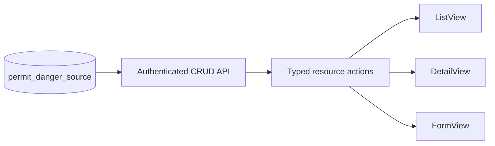

# Permit Danger Source Design

- **Status:** Design approved in chat; written-spec review pending
- **Date:** 2026-08-19
- **Scope:** The `permit-danger-source` master data module
- **Legacy source:** `/Users/gamer/Documents/projects/ads-hk-legacy`

## Goal

Add the legacy-backed danger source master data screen with the current
ADS-HK standard CRUD API and resource surfaces. Preserve the legacy labels,
values, active-state behavior, audit fields, and table contract.

## Legacy contract

The legacy config is
`frontend-ads-vuejs/src/app/configs/permit-danger-source.ts`:

- Page title: `Sumber Bahaya`
- Visible fields: `name`, `description`, `active`
- Menu key: `permit-danger-source`
- Menu title: `Sumber Bahaya`

The legacy table is `permit_danger_source`. It has `id`, `name`, nullable
unique `code`, nullable `description`, `active` with default `true`,
creator/updater IDs, and timestamps. The new API uses the repository
camel-case contract.

### Field matrix

| Field | Label | Create | Update | List/detail | Form control | Source |
| --- | --- | --- | --- | --- | --- | --- |
| `name` | `Nama` | required | editable | visible | text input | user |
| `description` | `Deskripsi` | optional | editable | visible | textarea | user |
| `active` | `Status` | default `true` | editable | visible | radio: `Aktif`, `Tidak Aktif` | user |
| `code` | `Kode` | optional nullable | editable | hidden | none | API only |
| audit fields | legacy audit labels | server only | server only | hidden | none | authenticated user/time |

`code` remains available in the API because it exists in legacy. The legacy
screen does not expose it.

## Ownership and data flow

- API files belong in `apps/api/src/routes/permit-danger-source/`.
- Web files belong beside the route in
  `apps/web/src/routes/(authenticated)/master-data/permit-danger-source/`.
- Register the API domain and installed routes through the existing route
  registry. Add the module to the system authorization catalog and seeded
  role permissions.
- Reuse `defineResource`, `ListView`, `DetailView`, and `FormView`. Do not add
  framework code or a local generic CRUD component.

## Routes and actions

Web routes:

- `/master-data/permit-danger-source`
- `/master-data/permit-danger-source/create`
- `/master-data/permit-danger-source/:permitDangerSourceId/detail`
- `/master-data/permit-danger-source/:permitDangerSourceId/edit`

Use standard list, detail, create, update, and delete actions. Use the current
permission names:

- `view-permit-danger-source`
- `list-permit-danger-source`
- `detail-permit-danger-source`
- `create-permit-danger-source`
- `update-permit-danger-source`
- `delete-permit-danger-source`

Add the menu entry under the legacy `Work Permit` separator with the exact
label `Sumber Bahaya`.

## Validation and delete behavior

- Trim `name` and reject an empty value.
- Validate nullable `code` as unique when supplied.
- Validate `active` as a boolean and default it to `true` on create.
- Set audit fields from the authenticated user and current time.
- Use the repository standard validation, authorization, and delete behavior.

## Seed data

Extend the existing idempotent API seed flow with these 20 legacy names. Keep
the names exact and active by default:

1. `Listrik`
2. `Gas`
3. `Ergonomi`
4. `Penggalian`
5. `Pada Ketinggian`
6. `Bongkar Muat`
7. `Alat listrik`
8. `Bahan kimia`
9. `Bertekanan`
10. `Penggunaan Bahan Kimia`
11. `Uji Bertekanan`
12. `Pengecatan`
13. `Moving part`
14. `Bising`
15. `Mudah terbakar`
16. `Lifting`
17. `Drilling`
18. `Crane`
19. `Kejatuhan`
20. `Biologi`

Seed records by stable legacy identity so a repeat run updates the same rows
and does not create duplicates.

## Verification contract

- API tests cover list, detail, create, update, delete, validation, and
  permission checks.
- Web tests cover field keys, exact labels, active options, resource actions,
  and route registration.
- Run focused type, lint, and test checks for the API and web packages.
- Use seeded data in an authenticated T3 preview to verify list, detail,
  create, edit, delete, permission visibility, and the exact labels.
- Run `$verify-ads-hk-module` after implementation. Do not mark this module
  complete before the verifier returns `PASS`.

## Exclusions

- No lookup endpoint is required for this master data screen.
- No visible code field is required.
- No framework package change, backward-compatibility adapter, or unrelated
  master data change is part of this module.
