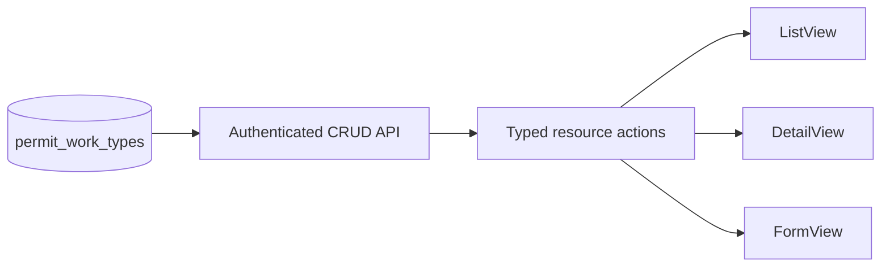

# Permit Work Types Design

- **Status:** Design approved in chat; written-spec review pending
- **Date:** 2026-08-19
- **Scope:** The `permit-work-types` master data module
- **Legacy source:** `/Users/gamer/Documents/projects/ads-hk-legacy`

## Goal

Add the legacy-backed work permit type master data screen with the current
ADS-HK standard CRUD API and resource surfaces. Preserve the legacy labels,
values, active-state behavior, audit fields, and delete behavior.

## Legacy contract

The legacy config is
`frontend-ads-vuejs/src/app/configs/permit-work-types.ts`:

- Page title: `Tipe Pekerjaan`
- Visible fields: `name`, `description`, `active`
- Menu key: `permit-work-types`
- Menu title: `Tipe Pekerjaan`

The legacy table is `permit_work_types`. It has `id`, `name`, nullable unique
`code`, nullable `description`, `active` with default `true`, creator/updater
IDs, and timestamps. The new API uses the repository camel-case contract for
these fields.

### Field matrix

| Field | Label | Create | Update | List/detail | Form control | Source |
| --- | --- | --- | --- | --- | --- | --- |
| `name` | `Nama` | required | editable | visible | text input | user |
| `description` | `Deskripsi` | optional | editable | visible | textarea | user |
| `active` | `Status` | default `true` | editable | visible | radio: `Aktif`, `Tidak Aktif` | user |
| `code` | `Kode` | optional nullable | editable | hidden | none | API only |
| audit fields | legacy audit labels | server only | server only | hidden | none | authenticated user/time |

`code` is kept for the data contract because it exists in legacy. The legacy
screen does not expose it, so the new screen does not expose it.

## Ownership and data flow

- API files belong in `apps/api/src/routes/permit-work-types/`.
- Web files belong beside the route in
  `apps/web/src/routes/(authenticated)/master-data/permit-work-types/`.
- Register the API domain and installed routes through the existing route
  registry. Add the module to the system authorization catalog and seed role
  permissions.
- Use the existing `defineResource`, standard `ListView`, `DetailView`, and
  `FormView` patterns. Do not add framework code or a local generic CRUD
  component.

## Routes and actions

Web routes:

- `/master-data/permit-work-types`
- `/master-data/permit-work-types/create`
- `/master-data/permit-work-types/:permitWorkTypeId/detail`
- `/master-data/permit-work-types/:permitWorkTypeId/edit`

Use standard list, detail, create, update, and delete actions. Use the current
permission names:

- `view-permit-work-types`
- `list-permit-work-types`
- `detail-permit-work-types`
- `create-permit-work-types`
- `update-permit-work-types`
- `delete-permit-work-types`

Add the menu entry under the legacy `Work Permit` separator with the exact
label `Tipe Pekerjaan`.

## Validation and delete behavior

- Trim `name` and reject an empty value.
- Validate nullable `code` as unique when supplied.
- Validate `active` as a boolean and default it to `true` on create.
- Set audit fields from the authenticated user and current time.
- Deleting a work type cascades its linked permit attachments, matching the
  legacy foreign key behavior.
- Use the repository standard validation and authorization error responses.

## Seed data

Extend the existing idempotent API seed flow with the ten legacy rows. Keep
the names exact and active by default:

1. `Hot Work`
2. `Electrical`
3. `Cold Work`
4. `Demolition`
5. `Working At Height`
6. `Confined Space Entry`
7. `Gas Test`
8. `Excavation`
9. `Work Over Water`
10. `Radiography`

Seed records by stable legacy identity so a repeat run updates the same rows
and does not create duplicates.

## Verification contract

- API tests cover list, detail, create, update, delete, validation, and
  permission checks.
- Web tests cover field keys, exact labels, active options, resource actions,
  and route registration.
- Run focused type, lint, and test checks for the API and web packages.
- Use seeded data in an authenticated T3 preview to verify list, detail,
  create, edit, delete, permission visibility, and the exact labels.
- Run `$verify-ads-hk-module` after implementation. Do not mark this module
  complete before the verifier returns `PASS`.

## Exclusions

- No lookup endpoint is required for this master data screen.
- No visible code field is required.
- No framework package change, backward-compatibility adapter, or unrelated
  master data change is part of this module.
