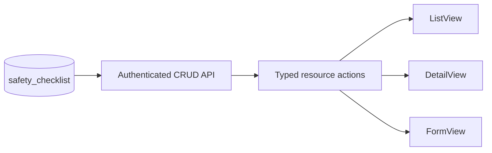

# Safety Checklist Design

- **Status:** Design approved in chat; written-spec review pending
- **Date:** 2026-08-19
- **Scope:** The `safety-checklist` master data module
- **Legacy source:** `/Users/gamer/Documents/projects/ads-hk-legacy`

## Goal

Add the legacy-backed safety checklist master data screen with the current
ADS-HK standard CRUD API and resource surfaces. Preserve the legacy title,
names, visible fields, active-state behavior, audit fields, and table contract.

## Legacy contract

The legacy config is
`frontend-ads-vuejs/src/app/configs/safety-checklist.ts`:

- Page title: `Safety Checklist`
- Visible fields: `name`, `active`
- Menu key: `safety-checklist`
- Menu title: `Safety Checklist`

The legacy table is `safety_checklist`. It has `id`, `name`, nullable unique
`code`, nullable `description`, `active` with default `true`, creator/updater
IDs, and timestamps. The legacy screen does not expose `description` or
`code`; the new screen keeps both fields out of the UI.

### Field matrix

| Field | Label | Create | Update | List/detail | Form control | Source |
| --- | --- | --- | --- | --- | --- | --- |
| `name` | `Nama` | required | editable | visible | text input | user |
| `active` | `Status` | default `true` | editable | visible | radio: `Aktif`, `Tidak Aktif` | user |
| `description` | `Deskripsi` | optional | editable | hidden | none | API only |
| `code` | `Kode` | optional nullable | editable | hidden | none | API only |
| audit fields | legacy audit labels | server only | server only | hidden | none | authenticated user/time |

## Ownership and data flow

- API files belong in `apps/api/src/routes/safety-checklist/`.
- Web files belong beside the route in
  `apps/web/src/routes/(authenticated)/master-data/safety-checklist/`.
- Register the API domain and installed routes through the existing route
  registry. Add the module to the system authorization catalog and seeded
  role permissions.
- Reuse `defineResource`, `ListView`, `DetailView`, and `FormView`. Do not add
  framework code or a local generic CRUD component.

## Routes and actions

Web routes:

- `/master-data/safety-checklist`
- `/master-data/safety-checklist/create`
- `/master-data/safety-checklist/:safetyChecklistId/detail`
- `/master-data/safety-checklist/:safetyChecklistId/edit`

Use standard list, detail, create, update, and delete actions. Use the current
permission names:

- `view-safety-checklist`
- `list-safety-checklist`
- `detail-safety-checklist`
- `create-safety-checklist`
- `update-safety-checklist`
- `delete-safety-checklist`

Add the menu entry under the legacy `Work Permit` separator with the exact
label `Safety Checklist`.

## Validation and delete behavior

- Trim `name` and reject an empty value.
- Validate nullable `code` as unique when supplied.
- Validate `active` as a boolean and default it to `true` on create.
- Set audit fields from the authenticated user and current time.
- Use the repository standard validation, authorization, and delete behavior.

## Seed data

Extend the existing idempotent API seed flow with the 17 legacy names. Keep
the names exact and active by default. The source contains one trailing tab in
the fifteenth value; preserve that stored value for legacy parity:

1. `Apakah pekerja memahami pekerjaan yang akan dilakukan ?`
2. `Apakah bahaya pekerjaan sudah dipahami ?`
3. `Apakah tanda peringatan bahaya sudah dipasang ?`
4. `Apakah peralatan sudah diamankan dari sumber bahaya ?`
5. `Apakah peralatan bergerak sudah diisolasi ?`
6. `Apakah peralatan sudah dipasang LOTO ?`
7. `Lakukan pengamanan & pengawasan terhadap  percikan api las ?`
8. `Bahan-bahan yang mudah terbakar, perlu dipindah atau dilindungi ?`
9. `Apakah lubang-lubang disekitar pekerjaan sudah ditutup?`
10. `Amankan area kerja dari tumpahan minyak dan bocoran gas ?`
11. `Apakah ada pekerjaan lain disekitar tempat kerja ?`
12. `Apakah semua peralatan sudah berada pada posisi aman ?`
13. `Apakah peralatan elektrik sudah di grounding ?`
14. `Apakah alat pemadam sudah tersedia ?`
15. `Apakah petugas safety/ fire man stand by di lapangan ?\t`
16. `Apakah penunjuk arah angin tersedia ?`
17. `Apakah diperlukan ijin kerja lain ?`

Seed records by stable legacy identity so a repeat run updates the same rows
and does not create duplicates.

## Verification contract

- API tests cover list, detail, create, update, delete, validation, and
  permission checks.
- Web tests cover field keys, exact labels, the absence of description/code,
  active options, resource actions, and route registration.
- Run focused type, lint, and test checks for the API and web packages.
- Use seeded data in an authenticated T3 preview to verify list, detail,
  create, edit, delete, permission visibility, exact labels, and the visible
  two-field form.
- Run `$verify-ads-hk-module` after implementation. Do not mark this module
  complete before the verifier returns `PASS`.

## Exclusions

- No lookup endpoint is required for this master data screen.
- No visible code or description field is required.
- No framework package change, backward-compatibility adapter, or unrelated
  master data change is part of this module.
