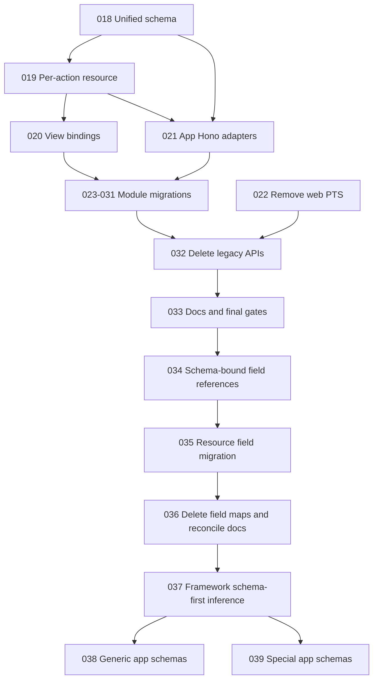

# Implementation Plans

Generated by the Improve skill. Plans 018-033 implemented the first frontend
resource and schema architecture. Plans 034-036 replace repeated action-local
field maps with schema-bound field references. Execute one module per pass when
plan 035 is active. Read the selected plan and
`.agents/skills/migrate-web-resource/SKILL.md` before a module migration.

## Execution order and status

| Plan | Title | Priority | Effort | Depends on | Status |
|---|---|---|---|---|---|
| 018 | Add unified web resource schema | P1 | M | — | DONE |
| 019 | Replace resource with per-action API | P1 | L | 018 | DONE |
| 020 | Bind Views to action prop bags | P1 | M | 019 | DONE |
| 021 | Add app-owned Hono adapters | P1 | M | 018, 019 | DONE |
| 022 | Remove web PTS module | P1 | S | — | DONE |
| 023 | Migrate basic CRUD cohort | P1 | M | 018-021 | DONE |
| 024 | Migrate read-only cohort | P1 | M | 018-021 | DONE |
| 025 | Migrate transformed CRUD cohort | P1 | L | 018-021; module checkpoints | DONE |
| 026 | Migrate project vendors | P2 | M | projects checkpoint | DONE |
| 027 | Migrate work-items workflow | P2 | L | lookup checkpoints | DONE |
| 028 | Migrate users | P1 | L | roles checkpoint | DONE |
| 029 | Migrate assignment-catalog cohort | P2 | L | permissions, roles, users | DONE |
| 030 | Migrate project-role assignments | P2 | L | users, roles, divisions, projects | DONE |
| 031 | Migrate notifications | P2 | L | 018-021 | DONE |
| 032 | Remove legacy resource APIs | P1 | L | 018-031 and every checkpoint | DONE |
| 033 | Reconcile architecture docs and gates | P2 | M | 032 | DONE |
| 034 | Add schema-bound field references | P1 | M | 018-033 | DONE |
| 035 | Migrate resource actions to field references | P1 | L | 034 | DONE |
| 036 | Remove action field maps and reconcile docs | P1 | M | 034, 035 | DONE |
| 037 | Establish schema-first Zod inference | P1 | M | 036 | DONE |
| 038 | Migrate generic app Zod schemas | P1 | S | 037 | DONE |
| 039 | Migrate special app Zod schemas | P1 | M | 037, 038 edit gate | DONE |

Status values: TODO | IN PROGRESS | DONE | BLOCKED (with reason) | REJECTED (with rationale).

## Dependency flow

## Cohort execution rules

- Plan 023 order is flexible, but business categories must finish before divisions, and UOMs plus PTS work categories must finish before work items.
- Plan 024 must finish number variables before number configs. Permissions must finish before role permissions.
- Plan 025 must finish divisions before projects and roles before users.
- Plan 029 is one plan for two similar catalogs, but each module is a separate execution and checkpoint.
- A cohort plan stays IN PROGRESS until all named module checkpoints are complete and reviewed.
- Plan 035 follows the same one-module execution rule and stays IN PROGRESS
  until all 17 field-reference checkpoints are complete.
- Plans 038 and 039 split schema migration by schema behavior. Direct entity
  bindings belong to 038. Local preprocess or transform behavior belongs to
  039. Resource complexity outside the schema does not move a module to 039.

## Findings considered and rejected

- One plan per module: rejected because repeated plain CRUD plans add noise without adding implementation safety.
- One execution for a whole cohort: rejected because it creates large diffs and weak verification boundaries.
- A generic transport interface for Hono, services, and fetch: rejected because direct functions already cover non-Hono resources.
- A generic nested-resource or assignment-workflow abstraction: rejected because current modules share syntax, not enough domain behavior.
- Backward-compatibility wrappers: rejected by project policy and the approved design.
- A separate standard raw-form type: rejected because the schema already owns
  raw input and parsed output, and no current resource caller needs a typed raw
  draft.
- One combined app schema migration plan: rejected because `users` and `roles`
  have schema-level input/output behavior that needs a separate verification
  boundary from direct entity bindings.

## Superseded field decision

Plans 019 and 023-033 correctly describe the first per-action migration, but
their complete flat action-field maps caused repeated field behavior. Plan 034
locks the replacement: `defineFields(schema, definitions)`, ordered field
references, and one terminal partial override. Plans 034-036 must ship together,
so the temporary map input in plan 034 never becomes a supported API.
