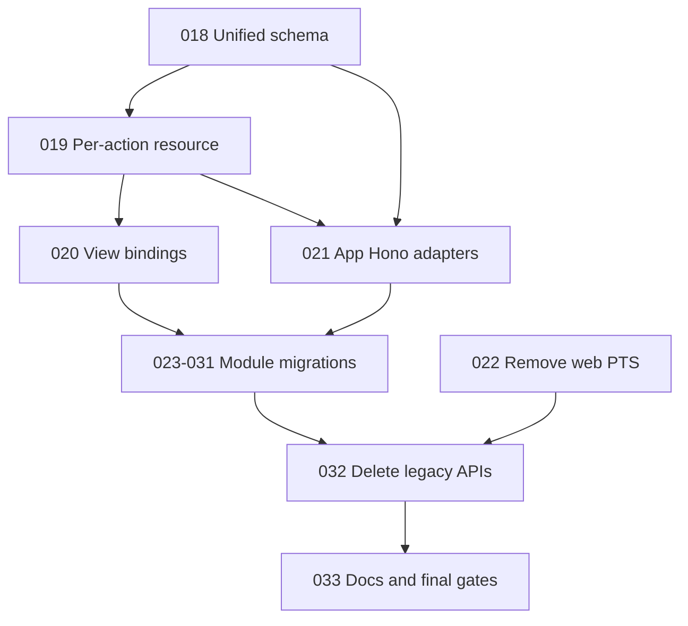

# Implementation Plans

Generated by the Improve skill on 2026-08-11. Plans 018-033 implement the approved frontend resource and schema architecture. Execute one module per pass, even when a plan names a cohort. Read the selected plan and `.agents/skills/migrate-web-resource/SKILL.md` before a module migration.

## Execution order and status

| Plan | Title | Priority | Effort | Depends on | Status |
|---|---|---|---|---|---|
| 018 | Add unified web resource schema | P1 | M | — | TODO |
| 019 | Replace resource with per-action API | P1 | L | 018 | TODO |
| 020 | Bind Views to action prop bags | P1 | M | 019 | TODO |
| 021 | Add app-owned Hono adapters | P1 | M | 018, 019 | TODO |
| 022 | Remove web PTS module | P1 | S | — | TODO |
| 023 | Migrate basic CRUD cohort | P1 | M | 018-021 | TODO (0/4 modules) |
| 024 | Migrate read-only cohort | P1 | M | 018-021 | TODO (0/2 modules) |
| 025 | Migrate transformed CRUD cohort | P1 | L | 018-021; module checkpoints | TODO (0/4 modules) |
| 026 | Migrate project vendors | P2 | M | projects checkpoint | TODO |
| 027 | Migrate work-items workflow | P2 | L | lookup checkpoints | TODO |
| 028 | Migrate users | P1 | L | roles checkpoint | TODO |
| 029 | Migrate assignment-catalog cohort | P2 | L | permissions, roles, users | TODO (0/2 modules) |
| 030 | Migrate project-role assignments | P2 | L | users, roles, divisions, projects | TODO |
| 031 | Migrate notifications | P2 | L | 018-021 | TODO |
| 032 | Remove legacy resource APIs | P1 | L | 018-031 and every checkpoint | TODO |
| 033 | Reconcile architecture docs and gates | P2 | M | 032 | TODO |

Status values: TODO | IN PROGRESS | DONE | BLOCKED (with reason) | REJECTED (with rationale).

## Dependency flow

## Cohort execution rules

- Plan 023 order is flexible, but business categories must finish before divisions, and UOMs plus PTS work categories must finish before work items.
- Plan 024 must finish number variables before number configs. Permissions must finish before role permissions.
- Plan 025 must finish divisions before projects and roles before users.
- Plan 029 is one plan for two similar catalogs, but each module is a separate execution and checkpoint.
- A cohort plan stays IN PROGRESS until all named module checkpoints are complete and reviewed.

## Findings considered and rejected

- One plan per module: rejected because repeated plain CRUD plans add noise without adding implementation safety.
- One execution for a whole cohort: rejected because it creates large diffs and weak verification boundaries.
- A generic transport interface for Hono, services, and fetch: rejected because direct functions already cover non-Hono resources.
- A generic nested-resource or assignment-workflow abstraction: rejected because current modules share syntax, not enough domain behavior.
- Backward-compatibility wrappers: rejected by project policy and the approved design.
