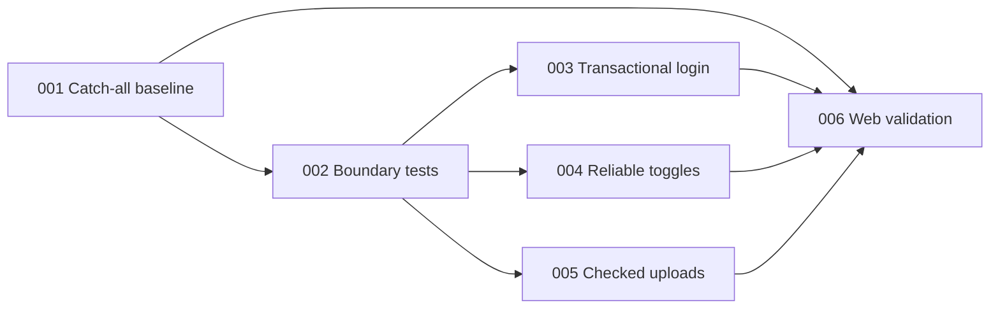

# Implementation Plans

Generated by the `improve` skill on 2026-07-12 for `apps/web/` only, against commit `b5402b7`. Execute in the order below unless dependencies say otherwise. Each executor must read its plan fully, honor all STOP conditions, and update its status row when done.

## Execution order and status

| Plan | Title | Priority | Effort | Depends on | Status |
|---|---|---|---|---|---|
| [001](001-restore-catch-all-route.md) | Restore a rendered catch-all route | P1 | S | — | DONE |
| [002](002-characterize-auth-mutation-boundaries.md) | Characterize authentication and mutation boundaries | P1 | M | 001 | DONE |
| [003](003-make-login-transactional.md) | Make login state persistence transactional | P1 | S | 002 | TODO |
| [004](004-reconcile-permission-toggles.md) | Reconcile optimistic permission toggles | P1 | M | 002 | TODO |
| [005](005-check-presigned-upload-transaction.md) | Check presigned upload completion before registration | P1 | M | 002 | TODO |
| [006](006-add-web-validation-gates.md) | Add non-mutating lint and CI gates | P2 | M | 001, 003, 004, 005 | TODO |

Status values: `TODO`, `IN PROGRESS`, `DONE`, `BLOCKED (reason)`, or `REJECTED (rationale)`.

## Dependency notes

- 001 restores a green suite, which every later plan uses as a verification baseline.
- 002 creates reusable test harnesses before production behavior changes.
- 003, 004, and 005 are independent after 002 and may be executed in parallel in isolated branches/worktrees if desired.
- 006 runs last so its lint and CI baseline includes the production/test changes from 003-005 and can gate the complete result.



## Verification commands shared by the plans

Run from the repository root:

```sh
pnpm --filter @southneuhof/framework-web test
pnpm --filter @southneuhof/framework-web type-check
pnpm --filter @southneuhof/framework-web build
```

After plan 006, also run:

```sh
pnpm --filter @southneuhof/framework-web lint
```

## Deferred findings

- Spreadsheet export security/dependency hardening was explicitly excluded from this plan set by the maintainer.
- Lazy-loading spreadsheet/chart code, pruning unused app dependencies, retiring vendored TinyMCE, responsive-navigation consolidation, README reconciliation, completing typed user-role RPC, and dashboard direction remain unplanned audit findings.

## Findings considered and rejected

- Client-side permission state as a security boundary: not planned because real authorization belongs to the API, which was explicitly outside this web-only audit and plan scope.
- `html2pdf.js` dependency advisories: not planned because the audit did not demonstrate a currently reachable `apps/web` route/import path; re-evaluate if a PDF surface is enabled.
