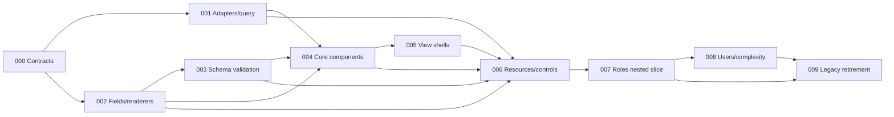

# Implementation Plans

Originally generated by the `improve` skill on 2026-07-12 and extended on 2026-07-22 with the web architecture migration planned against commit `edeff25`. Revised 2026-07-26: design decisions recorded in the architecture document's Addendum (prop factories, `behavior` block, vocabulary rules, HTML5 history, clean break, full-scope sequencing); the pinned document hash is `6fbc44a012d92c4462e08914ca75b5b4226845c8`. On the same date, six completed pre-migration audit plans (restore catch-all route, characterize auth boundaries, transactional login, permission-toggle reconciliation, presigned-upload check, validation gates — all DONE) were removed from this index and the migration plans renumbered to start at 000; the removed plans' work remains in git history. Execute in dependency order.

Drift-check semantics: every plan diffs `edeff25..HEAD` over its watched paths. Changes attributable to plans marked `DONE` in this index are expected and are not drift; any other change — or an architecture-document hash mismatch — is drift and a STOP until reviewed. Every implementation pass must read its plan fully, run its drift checks, honor STOP conditions, and update its row after implementation and review.

## Execution order and status

| Plan | Title | Priority | Effort | Depends on | Status |
|---|---|---|---|---|---|
| [000](000-establish-migration-contracts.md) | Establish migration contracts and a green baseline | P1 | M | — | DONE |
| [001](001-add-project-adapters-and-query-runtime.md) | Add project adapters and namespaced query runtime | P1 | L | 000 | DONE |
| [002](002-build-field-catalog-and-renderers.md) | Build shared field catalog and renderer registry | P1 | L | 000 | DONE |
| [003](003-derive-validation-from-schemas.md) | Derive validation from client-safe schemas | P1 | L | 000, 002 | DONE |
| [004](004-rebuild-core-components.md) | Rebuild Form, Table, and Detail cores | P1 | L | 001, 002, 003 | DONE |
| [005](005-add-resource-view-shells.md) | Add declarative resource view shells | P1 | L | 004 | DONE |
| [006](006-build-native-resource-definitions.md) | Build native resource definitions and controls | P1 | L | 001-005 | DONE |
| [007](007-migrate-roles-as-nested-slice.md) | Migrate roles and permissions as nested slice | P1 | L | 006 | DONE |
| [008](008-migrate-users-and-prove-complexity.md) | Migrate users and prove complex cases | P1 | L | 007 | DONE |
| [009](009-retire-legacy-crud-architecture.md) | Retire legacy CRUD architecture and publish guidance | P2 | L | 007, 008 | DONE |

Status values: `TODO`, `IN PROGRESS`, `DONE`, `BLOCKED (reason)`, or `REJECTED (rationale)`.

## Backend track: Sprindle production readiness (added 2026-07-26)

Planned against commit `694c905` by a comparative audit of `packages/sprindle` against the mature production backend at `/Users/gamer/Documents/projects/hka-trom/backend` (external reference only — never modified). Scope rule decided with the maintainer: the framework ships request-lifecycle and source-contract correctness plus seams; policies and formats stay app-level. Backend plans drift-check `694c905..HEAD`; changes attributable to DONE backend plans are expected.

| Plan | Title | Priority | Effort | Depends on | Status |
|---|---|---|---|---|---|
| [010](010-backend-verification-baseline.md) | Establish a backend verification baseline (CI + lint) | P1 | S | — | DONE |
| [011](011-atomic-source-writes.md) | Make Drizzle source writes atomic | P1 | M | 010 | DONE |
| [012](012-working-list-queries.md) | Implement list queries (pagination/filter/sort/search, single-query reads) | P1 | L | 010, 011 | DONE |
| [013](013-error-contract.md) | Establish a single error contract | P1 | M | 010 | DONE |
| [014](014-authz-seam.md) | Add the authorization seam (identity, 401/403) | P1 | M | 013 | DONE |
| [015](015-request-id-and-logger-seam.md) | Add request ids and a logger seam | P2 | S | 013 | DONE |
| [016](016-test-utilities.md) | Ship test utilities (memory source, test app) | P2 | M | 012, 013 | DONE |
| [017](017-openapi-emission.md) | Emit OpenAPI from installed models | P2 | M | 012, 013 | DONE |
| [018](018-migrations-convention.md) | Adopt versioned migrations and a seed convention | P2 | S | 010 | DONE |
| [019](019-framework-docs.md) | Write the Sprindle reference docs and agent guide | P2 | M | 011–018 (documents what landed; run last) | DONE |
| [020](020-dependency-hygiene.md) | Unify Zod imports, isolate Drizzle internals | P2 | M | 010 (run after 011–017) | DONE |

### Backend dependency notes

- 010 first — it makes every later plan's verification gate enforced (no CI or lint exists for `packages/sprindle`/`apps/api` today).
- 011 → 012 are sequential rewrites of the same file (`source/drizzle-source.ts`); 012 must preserve 011's materialize-on-tx property. Pagination and the N+1 fix were deliberately merged into 012 — separate plans would conflict in that file.
- 013 is independent after 010; 014 and 015 consume its `HttpError` constructors and `sprindleOnError`. 014 and 015 both extend `installSprindle` options — whichever runs second merges into one options object.
- 016 mirrors 012's query semantics in a memory source (conformance witness); 017 serializes 012/013's wire shapes. Neither can precede them.
- 019 documents landed behavior only; 020 is deliberately last among code plans to avoid rebasing 011–017.

### Backend findings considered and rejected (so nobody re-audits)

Framework-inclusion test applied: core only if (a) every app rebuilds it identically, (b) it must be correct below the app, or (c) it fits existing vocabulary with zero new nouns.

- **RBAC/permissions in core**: rejected — the framework ships the seam (plan 014); role/permission storage and codes are app policy. The reference app's four inconsistent enforcement points came from a missing seam, not missing framework RBAC.
- **Audit-log hook in core**: rejected — the pipeline's `after`/model hooks are the extension point; audit shape is compliance policy. Recipe in plan 019's `docs/recipes.md`.
- **Excel/PDF export in core**: rejected — formats and layouts are domain; the reference app's per-module export dispatch ladders prove every export is special. List-query reuse (plan 012) is the only framework contribution.
- **File upload/storage, background jobs, caching, rate limiting, health checks, CORS/security headers, config loading, i18n in core**: rejected — Hono middleware territory, policy, or format; recipes only (plan 019).
- **Scaffolding/introspection CLI** (reference app's `generate:model`): rejected — Sprindle is schema-first with types-over-codegen; conventions documentation (plan 019) replaces generators.
- **Soft-delete vocabulary**: rejected — the reference implementation is inconsistent and inverted; apps model an `active` flag themselves if needed.
- **Userland transaction boundary** (route action + hooks in one tx): deferred, not rejected — revisit on demonstrated need (noted in plan 011).
- **Operator filters / searchable-sortable allowlists / cursor pagination**: deferred — wait for a real consumer (noted in plan 012).

## Contract track (added 2026-07-27)

Planned against commit `4ab2c8f`. Removes the hand-written schema mirror's *cause* — entity modules
that could not be imported into a browser bundle — and measures what importing them actually costs,
so the decision to retire `packages/contracts/src/schemas/index.ts` rests on a number.

| Plan | Title | Priority | Effort | Depends on | Status |
|---|---|---|---|---|---|
| [021](021-browser-safe-entity-schemas.md) | Make entity Zod schemas importable in the browser | P1 | M | — | DONE |
| [022](022-rebuild-identity-and-org-structure.md) | Retire the mirror (folded into the identity rebuild) | P1 | L | 021 | DONE |

Outcome: entity modules are browser-importable, the Zod bridge accepts both the classic and `zod/v4`
dialects, and `roles` validates against `role.schemas` directly. The measured cost is a **one-time**
+55 kB gzipped for the `drizzle-orm` + `drizzle-zod` construction machinery and +529 B per additional
resource — see the plan's Measurement section. **GO, accepted 2026-07-27**: an internal system
application where load time is not a primary constraint.

**The mirror is gone.** Plan 022 carried out the follow-up, since it was rewriting the same entity
files: `packages/contracts/src/schemas/index.ts`, `apps/api/src/__tests__/schema-parity.spec.ts`, the
web `schemaAdapter`, and the dead stub `AppType` were all deleted. Every resource now declares
`schemas` from its entity module, and `apps/web/src/framework/__tests__/entity-schema-import.spec.ts`
covers all of them plus two static scans (no node builtins, no `@southneuhof/sprindle/model`).
`packages/contracts` remains as an empty directory with a README saying so; no app depends on it.
Entity modules stayed at `apps/api/src/routes/<name>/<name>.entity.ts` — `packages/domain` was
unavailable because `apps/base-mobile` consumes its theme tokens, and moving them would have pulled
`drizzle-orm` into the mobile app.

## HKA TROM proof slice (added 2026-07-27)

Planned against commit `4ab2c8f`. The accepted slice and its decision record live in
[NOTES-trom-proof-slice.md](NOTES-trom-proof-slice.md) — read it before executing any of these.
Plan 022 is a prerequisite for the slice and carries all destructive work; 023–025 are the slice.

| Plan | Title | Priority | Effort | Depends on | Status |
|---|---|---|---|---|---|
| [022](022-rebuild-identity-and-org-structure.md) | Rebuild identity and org structure, retire the mirror, reset to one baseline | P1 | L | 021 | DONE |
| [023](023-notification-subsystem.md) | Build the notification subsystem and the scoped list seam | P1 | L | 022 | DONE |
| [024](024-overtime-workflow.md) | Build the overtime workflow and its verificator chain | P1 | L | 023 | DONE |
| [025](025-overtime-and-inbox-screens.md) | Build the overtime screens, inbox, and typed deep-link registry | P1 | L | 024 | DONE |

**Verdict: the slice needed no framework change.** Neither `packages/sprindle` nor
`packages/is-vue-framework` was modified. The findings — including the two things the planning
mispredicted — are recorded in [NOTES-trom-proof-slice.md](NOTES-trom-proof-slice.md), which is now
the slice's result rather than its proposal. Read that before starting a second module.

### Slice dependency notes

- **022 is destructive and must run first.** It drops every table in `public`, deletes the existing
  migration, and regenerates a single baseline. Authorized by the maintainer 2026-07-27; the plan
  requires one more confirmation immediately before the drop. Migrations are additive from 023 onward.
- 022 absorbed the organizational tables (`tollSections`, `sectionTypes`, `jobPositions`,
  `sectionGroups`, `sectionRantings`) because `employees` carries foreign keys into them, and
  `employees` is part of the identity model. 023 is therefore notifications and chain configuration only.
- 022 also folds in plan 021's deferred follow-up: deleting `packages/contracts/src/schemas/index.ts`
  and `apps/api/src/__tests__/schema-parity.spec.ts`, since the same entity files are being rewritten.
- Each plan names `packages/sprindle` / `packages/is-vue-framework` changes as a STOP condition. The
  slice exists to find out whether the frameworks are sufficient; a framework edit made mid-slice
  destroys the answer. Report the gap instead.

### Questions the slice is built to answer

1. Can a custom `ModelSource` express a caller-scoped list, or is `ModelSource` an extension point that
   cannot see the caller? (023, Step 4)
2. Can one transaction span a workflow's multi-table writes through `getDb().transaction()` in a custom
   route, with notification dispatch after commit? (024, Step 5)
3. Can a record-state-dependent control be expressed without a framework change? (025, Step 3)

## Web routing and controls overhaul (added 2026-07-27)

Planned against commit `e4f345c`. The design was decided with the maintainer on 2026-07-27 and is
recorded in the Addendum of
[docs/architecture/routing-and-controls-review.md](../docs/architecture/routing-and-controls-review.md)
— that Addendum is the specification; the plans implement it in order. Summary of the decisions:
identity is a declared shape per resource (`{id}` from `record.id` is the default, not framework
language; list and function spellings; `TIdentity` inferred and threaded end-to-end); standard
controls fold into the resource surface factories and `standardControls` goes internal; detail is
always an explicit `/detail` sibling with a `.layout.vue` shell, a first-valid-tab guard, and
`meta.tabs` on the shell as the single presentation source (child meta owns access truth). Clean
break on URLs: every detail URL gains `/detail`, no legacy redirects.

| Plan | Title | Priority | Effort | Depends on | Status |
|---|---|---|---|---|---|
| [026](026-declared-identity-shapes.md) | Declared identity shapes with composite support | P1 | M | — | DONE |
| [027](027-fold-controls-into-factories.md) | Fold standard controls into the resource surface factories | P1 | M | 026 | DONE |
| [028](028-detail-shells-tabs-and-urls.md) | Detail shells, first-valid-tab resolution, and the /detail URL convention | P1 | L | 026, 027 | DONE |

### Track dependency notes

- 026 is contracts + `defineResource` only and must leave every existing resource definition and
  route file compiling **unchanged** — its STOP conditions enforce the no-manual-generic and
  zero-app-edit requirements.
- 027 breaks the factory return shapes (bundles consumed via `v-bind`) and migrates the six
  `standardControls` call sites plus four adapter specs in the same plan. It gives
  `resource.identity` its first runtime consumer (`rowLink`).
- 028 is the only plan that touches URLs and the routing plugin. It depends on 027 so that changed
  `routes.detail` targets propagate through the factory bundles automatically. The guard, `Tabs`,
  and `identityFromRoute` live in the app's router integration layer; `is-vue-framework` stays
  router-agnostic (a 028 STOP condition).
- These plans supersede the review note's §2 flag on `controls.ts` and amend the shared invariant
  "standard controls are inferred from behavior + route target + UI access" — the inference now
  happens inside the factories rather than at call sites; the absence rule is unchanged.

## Web CRUD route simplification (revision added 2026-07-27)

Planned against commit `e4f345c` with the uncommitted implementation of plans 026–028 present
(watched source diff SHA-256:
`40c525fc1794f7156fde6f7d135fc27056564233d8a950ac8002917b88a3a843`). Maintainer review accepted
Vue Router as a framework dependency, rejected inverse resource/route identity reflection, kept
parent-owned tab membership, and restored bare record URLs for detail. Plans 029–031 implement that
revision without removing composite identity support. A later clarification requires detail pages
with presented children to keep all ID-context routes inside parameter folders. Marked
`[roleId]/index.route.vue` / `[userId]/index.route.vue` files are promoted into named parents by the
app route-tree hook; same file owns default DetailView, tab entrypoints, and child outlet.

| Plan | Title | Priority | Effort | Depends on | Status |
|---|---|---|---|---|---|
| [029](029-use-vue-router-resource-targets.md) | Make resource navigation native to Vue Router | P1 | M | 026–028 | DONE |
| [030](030-add-resource-first-view-shells.md) | Add resource-first ListView and DetailView shells | P1 | M | 029 | DONE |
| [031](031-simplify-detail-routes-and-tabs.md) | Make in-folder index details explicit route parents | P1 | L | 029, 030 | DONE |

### Revision dependency notes

- 029 runs first: named `RouteLocationRaw` targets decouple resource navigation from the URL moves in
  031 and prove explicit composite identity → route-param mapping.
- 030 consumes 029 so DetailView can derive delete, report failure, and navigate with the resource's
  typed list target. Raw factory/view modes remain escape hatches.
- 031 runs last: explicit build-only marker promotes in-folder index detail into named parent owning
  DetailView fallback, tabs, and child outlet. It deletes record layouts, removes shell machinery,
  enforces route permission meta, and deletes identity reflection.
- 026 remains authoritative for composite identity types/extractors. 031 supersedes only its later
  runtime-reflection addition (`identityKeys`).
- 027 remains authoritative for surface factories and inferred controls. 030 adds a resource-first
  component layer over those factories.
- 031 supersedes 028's `/detail`, first-valid-tab, `meta.tabs`, and `identityFromRoute` decisions.
  Plan 028 stays `DONE` as implementation history until 031 lands and records the supersession in
  architecture docs.

### Reconciliation result (2026-07-27)

The first post-execution review returned plans 029–031 to `IN PROGRESS`:

- 029: framework tests/type-check and web tests pass, but web type-check fails because the composite
  contract fixture names nonexistent app routes (`user-role-detail` / `user-role-update`).
- 030: resource-first shells and derived delete exist, but the required resource-mode and delete
  lifecycle tests were not added.
- 031: first execution used separate record layouts. Two follow-ups proved Vue Router 5.1 `_parent`
  cannot retain detail names. Sibling parameter files were rejected because ID-context files must
  stay inside parameter folders. Final revision is backed by executable real-generator proof at
  `plans/proofs/031-index-parent/prove.mjs`: marked `[roleId]/index.route.vue` generates
  `roles-detail` with typed `roleId`, edit/permissions children, and no runtime marker. Required
  Tabs/permission-guard tests also remain absent; five route files retain
  cast-plus-empty-string param extraction; and app installs no access adapter, so
  `createPermissionGuard()` resolves through permissive default. `app.use(router)` also precedes
  `FrameworkPlugin`, which would make initial navigation race any future installed access adapter.
- Reconciliation complete: composite fixture now uses valid path targets; resource/delete, parent,
  tab, and guard coverage exists; marked-index promotion is integrated; access adapter installs before
  router navigation; typed params replace route casts. Framework and web type-checks/tests, proof, and
  production build pass.

## Typed route manifest and native detail parents (clean-break revision added 2026-07-27)

Maintainer accepted a complete breaking migration after plan 031: filesystem remains structural
truth, one typed app manifest becomes semantic/navigation truth, and native `_parent.route.vue`
provides recursive detail-under composition inside ID folders. No mixed metadata mode or
compatibility layer is allowed.

| Plan | Title | Priority | Effort | Depends on | Status |
|---|---|---|---|---|---|
| [032](032-typed-route-manifest-native-parents.md) | Typed route manifest and native detail parents | P1 | L | 029–031 | DONE |
| [033](033-auto-select-first-valid-tab.md) | Auto-select first valid child tab at bare parent URLs | P1 | M | 032 | DONE |
| [034](034-scope-route-transitions-to-outlet-depth.md) | Scope route transitions to rendered outlet depth | P1 | M | 032, 033 | DONE |

### Clean-break dependency notes

- 032 is atomic because manifest application, removal of route-local metadata, and replacement of
  marked index parents must land together to keep generated names/meta valid.
- Real Vue Router generator proof at `plans/proofs/031-native-parent-typed/prove.mjs` confirms
  manifest-backed native `_parent` retains named parent, metadata, typed params, and children.
- Navigation becomes ordered projection of route catalog. Hidden/detail routes remain cataloged but
  do not appear in sidebar.
- Every native-parent child, including edit, renders under DetailView by explicit maintainer decision.
- 033 keeps resource detail targets on named parents. Mounted `Tabs` infers its owning matched record
  and replaces a bare owner with the first resolvable/permitted child; sibling and deeper routes are
  never selected merely because no tab is active.
- 034 makes transition ownership recursive: each `AppRouterView` keys the record rendered at its own
  depth. Child navigation preserves detail parents; record or parent-identity changes still animate
  the route page.

## File routes and resource actions as single truth (clean-break revision added 2026-07-27)

Planned against commit `e4f345c` with Plans 026–034 implemented in the dirty working tree (watched
source diff SHA-256:
`85c3b9a48dc9eb929293384b7a0030ec8e84ce84eb84c0bc9362fdf87296b1be`).
Maintainer rejected the full per-route manifest and accepted a complete breaking migration:
filesystem static segments mechanically produce route names; resource `actions` own each standard
target plus permission; navigation keeps entrypoints only. Dynamic params, route groups, and
`index` do not appear in names. `new` and `edit` remain literal—no CRUD synonym mapping.

| Plan | Title | Priority | Effort | Depends on | Status |
|---|---|---|---|---|---|
| [035](035-prove-mechanical-file-routes.md) | Prove mechanical file-route names and lazy action discovery | P1 | S | 034 | DONE |
| [036](036-make-files-and-resource-actions-route-truth.md) | Make file routes and resource actions the only CRUD route truth | P1 | L | 035 | DONE |

### Single-truth dependency notes

- 035 is proof-only. It uses the installed Vue Router generator/runtime to prove documented
  same-name file/folder detail nesting, static-only names with typed inherited params, and lazy
  resource registration before `beforeResolve`. Production migration must not start if either proof
  fails.
- 036 is atomic because route names, URLs, resource targets, permission lookup, navigation, tabs,
  and generated types reference one another. A staged dual API would temporarily create the exact
  second source of truth this track removes.
- Final detail shape is
  `[id]/detail.route.vue` plus `[id]/detail/<child>/index.route.vue`; edit/create are siblings.
  `_parent.route.vue` and its manifest name restoration are deleted.
- Final resource shape is `actions.{list,detail,create,update,delete}`. Every declared action spells
  permission explicitly; named targets expose their name structurally for direct-entry guard lookup.
  Child collections own their actions; parent details own only tab label/order/placement.

## Derived resource types and scalable operations (added 2026-07-27)

Planned against commit `17e7ed9` after Plans 035–036 completed. Maintainer chose a backend-neutral
core with optional Hono SDK tooling: Hono-backed applications infer resource record/request types
from exact RPC endpoints; bring-your-own backends may define types and `ResourceOperations`
manually. Complex operations remain separate from Vue and split by cohesive use case; resource
definition files stay declarative. Application resource and operation files live inside their
semantically owning route subtree for direct human navigation.

| Plan | Title | Priority | Effort | Depends on | Status |
|---|---|---|---|---|---|
| [037](037-add-optional-hono-resource-tools.md) | Make resource behavior type-exact without runtime route reflection | P1 | L | 036 | DONE |
| [038](038-split-resource-definitions-and-derive-types.md) | Colocate route resources, split operations, and derive types | P1 | L | 037 | DONE |

### Resource-type dependency notes

- 037 adds backend-neutral exact-key operation/resource types plus an explicit
  `@southneuhof/is-vue-framework/hono` subpath. Hono remains an optional peer and is not exported
  from the package root. Callers pass the typed `rpc.<resource>` parent directly. Its mapped public
  type exposes only real operations for autocomplete and build errors; its ordinary JavaScript
  object contains universal wrappers and is never enumerated as capability truth.
- 037 removes `ResourceCapabilities`. Existing `actions` remain runtime UI target, permission, and
  visibility truth; they never select transport operations. The API remains runtime enforcement.
  This deliberately trades runtime-exact enumerable operation keys for zero codegen, zero runtime
  discovery, no maintained capability metadata, and the concise parent-route call.
- 038 consumes the proven adapter, deletes broad RPC casts and handwritten transport mirrors, and
  colocates declarative resource files plus cohesive operation files at their nearest owning route
  subtree. It also makes the web package build run `vue-tsc` before Vite so invalid agent-authored
  transport/resource wiring cannot produce a successful build. No central application resource
  folder or route-folder barrel remains.
- UI-local optimistic/dialog/toast state remains in Vue. RPC calls, multi-request orchestration, and
  reusable workflows remain in operation files.
- Client-created projection types remain allowed when genuinely new. Existing API shapes must be
  derived, not retyped.
- [Hono RPC runtime dead ends](NOTES-hono-rpc-runtime-dead-ends.md) records rejected approaches and
  the accepted type-exact/action-exact resolution.

## Canonical create routes and FormView inputs (added 2026-07-27)

Planned against commit `2826b0a`. This is a clean break: creation screens use
the literal filesystem segment `create` and FormView becomes resource-first.
No `/new` URL alias, `FormView :form` compatibility branch, redirect,
deprecation warning, or prop normalization is permitted. Raw composed forms
remain supported only through the explicit new `formProps` escape hatch, in
parallel with DetailView's deliberate raw `detail` branch.

| Plan | Title | Priority | Effort | Depends on | Status |
|---|---|---|---|---|---|
| [039](039-canonical-create-routes-and-formview.md) | Make create routes and FormView contracts canonical | P1 | M | 038 | DONE |

### Canonical-create dependency notes

- 039 is atomic: filesystem filenames, generated route names, action targets,
  FormView calls, documentation, and removal of the legacy create-view mapping
  must agree in one change.
- DetailView remains untouched. It establishes the resource-first plus raw
  composition pattern; 039 applies that pattern to FormView with a new raw
  prop name so the old `form` spelling is invalid.

## Derived FormView success lifecycle (added 2026-07-27)

Planned against commit `2826b0a`. Standard resource forms return their record,
then FormView derives detail navigation (list fallback) from resource actions.
`afterSubmit` is an awaited free-form effect hook with a navigation controller;
it never returns a route. Raw `formProps` stays event-only because it has no
resource identity or action target.

| Plan | Title | Priority | Effort | Depends on | Status |
|---|---|---|---|---|---|
| [040](040-derive-form-success-lifecycle.md) | Derive FormView success navigation from resources | P1 | M | 039 | DONE |

### Form-success dependency notes

- 040 follows 039 because it extends FormView’s resource-first branch while
  preserving 039’s deliberately separate raw `formProps` branch.
- It is atomic across mutation return types, Hono unwrapping, view lifecycle,
  and app route cleanup: an envelope cast or route-side handler would recreate
  a second source of success policy.

## Internal TanStack Table engine (added 2026-07-27)

Planned against commit `2826b0a`. This is an internal engine migration: canonical
Table props, events, slots, exposed members, field vocabulary, one-based query
shape, loading behavior, and server-owned sorting/pagination remain unchanged.
TanStack Table types and instances never cross the framework boundary. Legacy
`components/composites/Table.vue` remains untouched.

| Plan | Title | Priority | Effort | Depends on | Status |
|---|---|---|---|---|---|
| [041](041-adopt-tanstack-table-engine.md) | Adopt TanStack Table internally without changing the Table contract | P1 | M | 004–006 | DONE |

### Table-engine dependency notes

- 041 starts with characterization tests against current core before adding the
  dependency or replacing internals.
- `useNamespacedQuery`, `useLoader`, TanStack Query, field resolution, renderer
  registry, and ListView/resource contracts remain authoritative.
- Selection and richer column features are deliberately deferred until each has
  a framework-owned contract; raw TanStack options are never public API.

## Collection pagination normalization (added 2026-07-28)

| Plan | Title | Priority | Effort | Depends on | Status |
|---|---|---|---|---|---|
| [042](042-preserve-normalized-collection-pagination.md) | Preserve pagination metadata across collection normalization | P1 | S | 041 | IN PROGRESS |

- 042 follows 041 because canonical Table now consumes normalized metadata for
  its server pagination engine. It makes framework and web normalizers
  idempotent, then proves the Hono resource → Table path retains `totalPage`.

## Dependency and delivery notes

- **Full-scope sequential phases (decided 2026-07-26)**: plans 001-006 are executed at full scope in order, each with its own complete verification gates. A walking-skeleton re-scoping was considered and reverted: it violated the plan-writing rules (self-containment, machine-checkable boundaries), and the framework is not co-developed with an app, so longer wall-clock time before the first slice is acceptable. Early-validation duty falls on plan 000's compile-time contract tests and plan 006's ordinary-resource fixture.
- **Clean break, no external consumers (decided 2026-07-26)**: `@southneuhof/is-vue-framework` has no consumers outside this monorepo. There are no compatibility wrappers, legacy prop normalization, or deprecation cycles. Legacy components/config remain untouched (keeping non-migrated screens green) until plan 009 deletes them wholesale with a major version bump. Plan 009 Step 2 verifies the no-consumer assumption before deletion.
- **HTML5 history (decided 2026-07-26)**: the web app moves from hash history to `createWebHistory` during plan 007. The app remains fully static/client-side; the only requirement is a static-host fallback rule (unknown path → `index.html`), documented in the app README. Legacy hash URLs are normalized client-side on boot.
- **Sibling-tab query preservation (decided 2026-07-26)**: when navigating between sibling routes under a shared parent layout (tab-style), links preserve sibling tables' namespaced query params within that subtree. Namespacing makes this collision-free; leaving the subtree drops them.
- 000 is a contracts/type baseline. It changes no feature behavior.
- 001 and 002 are independent after 000 and may run in parallel in isolated worktrees. 003 depends on the field contract but not the query runtime.
- 004 integrates query, fields, and validation in the core components. 005 adds only presentation shells. 006 composes both into direct resource prop factories.
- 007 is the first production slice and the reference for filesystem nesting. 008 adds a second slice and explicitly proves multi-table query ownership plus sync/offline loads.
- 009 starts only after zero active in-repo legacy usage.
- Each plan should be a reviewable PR/merge unit. Do not combine 000-006 into a single long-running branch.



## Shared architectural invariants

- File routes own navigation and hierarchy; nesting is placement plus parent identity, never a resource kind.
- Resources own ordinary data behavior and expose `table()`/`detail()`/`form()` prop factories returning exact native `TableProps`/`DetailProps`/`FormProps`. Identity and scoping are call arguments (`id`, `searchParameters`, `initialData`, `namespace`); `form()` wires create, `form({ id })` wires update, and Form itself never sees a mode. Parent scoping is an ordinary `searchParameters` entry — the framework has no `parent` vocabulary.
- Form/Table/Detail own data/field orchestration only. ListView/DetailView/FormView own Cards, headings, toolbars, feedback, and standard control placement.
- `load` is universal: it may return local, synchronous, cached, or remote asynchronous data. `data` and `load` are mutually exclusive.
- TanStack Query is internal. Public APIs expose `load`, `submit`, query namespace/local-state escape hatches, and semantic invalidation—not raw query keys/options.
- Ordinary RPC resources derive calls and Zod validation. Explicit operations, read/write hooks, schemas, query ownership, and controls are escape hatches.
- For Hono resources, TypeScript route keys are the operation contract; the runtime proxy-derived object is deliberately universal and must never be enumerated as capability metadata.
- Resource actions own standard-control visibility and navigation, UI access may further deny them, and the API remains authoritative at execution time. Runtime `ResourceCapabilities` are not a second source of truth.
- Dynamic field behavior is first-class: a field's form projection may carry a `behavior` block of pure function options (`visible`/`disabled`/`props`/`derived`/`resetWhen`) evaluated as computeds over the reactive draft with automatic dependency tracking — no manual depends-on lists (plan 002). Form owns the reactive wiring (plan 004); hidden fields are excluded from submission and validation runs on the filtered draft (plan 003). Behavior decides presence, schemas decide validity.
- Naming: `renderer` is the field-config key for widget selection on every surface (`table.renderer`/`detail.renderer`/`form.renderer`) — never `type` (value types belong to schemas) or `control`. The word "control(s)" refers exclusively to action controls (plans 005-006).
- Vocabulary rule: public API names must come from, in order of preference, (a) the legacy framework where semantics genuinely match (`searchParameters`, `initialData`, `fields`, `load`, `submit`), (b) Vue/HTML/TypeScript standard vocabulary (`props`, `namespace`, `visible`, `disabled`, `renderer`, `id`), or (c) plain English (`behavior`, `derived`). Coined compounds and framework-specific nouns are rejected in review unless no existing word is accurate; domain words (`parent`, `role`, `mapping`) never appear in framework APIs. Reusing a legacy name with changed semantics requires a loud migration-guide callout.
- Forbidden replacement vocabulary: form mode, nested-resource types, commands, action objects passed through state, or another composite screen orchestrator.

## Shared validation commands

Run relevant focused tests in each step, then from repository root before completing a phase:

```sh
pnpm --filter @southneuhof/is-vue-framework test
pnpm --filter @southneuhof/is-vue-framework type-check
pnpm --filter @southneuhof/framework-web test
pnpm --filter @southneuhof/framework-web type-check
pnpm --filter @southneuhof/framework-web build
pnpm --filter @southneuhof/framework-web lint
```

The 2026-07-22 planning baseline had green framework tests/types, green web tests/lint, and a web type-check failure resolving already-declared `better-auth` from an API source import. Plan 000 owns restoring a clean-install green baseline; later plans must not normalize that failure.

## Release gates after plans 007-008

- Nested route proof: real parent/child filesystem paths with no nested resource vocabulary.
- Direct binding proof: resources bind to cores with `v-bind` and no adapter components.
- Query proof: two tables work without manual query models; duplicate resource instances need an override only on the ambiguous instance.
- Load proof: synchronous/offline and remote loaders share the same API.
- Workflow proof: permission/role mapping remains explicit Vue code with error/concurrency behavior.
- Access proof: unavailable and denied standard controls are absent.
- Compatibility proof: legacy URLs redirect and non-migrated package consumers retain the selected support level.

## Deferred work

- The HKA TROM proof slice — overtime requests plus a slice of the notification subsystem — is **implemented** (plans 022–025, 2026-07-27). Its findings are in [NOTES-trom-proof-slice.md](NOTES-trom-proof-slice.md). Remaining gaps recorded there: the chain engine has one consumer and must not be generalized until a second module needs it; delivery is an in-memory transport; realized-hours calculation and real-time delivery were cut deliberately.
- The external `/Users/gamer/Documents/projects/hka-trom/frontend` repository is a design reference only and is not modified by these plans. Its migration starts after plan 009's downstream checklist and separate authorization.
- Shared mobile schemas remain deliberately out of scope.
- Backend authorization remains authoritative; UI access policy only controls presentation.
- Earlier deferred audit findings—spreadsheet/export hardening, TinyMCE retirement, dashboard direction, dependency pruning, and unrelated responsive-navigation work—remain outside this architecture migration.

## Findings considered and rejected

- Put CRUD chrome in Table/Detail/Form: rejected because it destroys primitive reusability; plan 005 owns chrome.
- Require explicit repeated API calls for every resource: rejected for ordinary RPC resources; plan 006 derives them while keeping explicit overrides.
- Reflect a Hono parent proxy into runtime-exact enumerable operation keys: rejected because route keys are erased at runtime. Plan 037 accepts a universal runtime wrapper with an exact mapped TypeScript surface; actions own UI visibility and the API enforces attempted calls.
- Expose TanStack Query in resource definitions: rejected to avoid infrastructure lock-in and a second public vocabulary.
- Preserve query-string screen orchestration as the routing model: rejected; only temporary redirects remain.
- Import API entity modules directly for validation: rejected if they carry server/database runtime dependencies; plan 003 requires a client-safe boundary. **Amended 2026-07-27**: plan 021 removed those runtime dependencies (`node:crypto`, and the Hono-carrying `@southneuhof/sprindle/model` subpath), so the condition attached to this rejection no longer holds — an entity module now *is* a client-safe boundary in plan 003's sense, and `roles` imports its schemas directly. What remains is a bundle-size question, not a correctness one; see plan 021's Measurement section.
