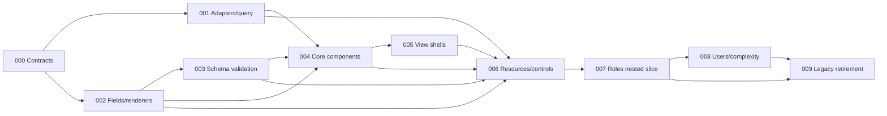

# Implementation Plans

Originally generated by the `improve` skill on 2026-07-12 and extended on 2026-07-22 with the web architecture migration planned against commit `edeff25`. Revised 2026-07-26: design decisions recorded in the architecture document's Addendum (prop factories, `behavior` block, vocabulary rules, HTML5 history, clean break, full-scope sequencing); the pinned document hash is `6fbc44a012d92c4462e08914ca75b5b4226845c8`. On the same date, six completed pre-migration audit plans (restore catch-all route, characterize auth boundaries, transactional login, permission-toggle reconciliation, presigned-upload check, validation gates — all DONE) were removed from this index and the migration plans renumbered to start at 000; the removed plans' work remains in git history. Execute in dependency order.

Drift-check semantics: every plan diffs `edeff25..HEAD` over its watched paths. Changes attributable to plans marked `DONE` in this index are expected and are not drift; any other change — or an architecture-document hash mismatch — is drift and a STOP until reviewed. Every implementation pass must read its plan fully, run its drift checks, honor STOP conditions, and update its row after implementation and review.

## Execution order and status

| Plan | Title | Priority | Effort | Depends on | Status |
|---|---|---|---|---|---|
| [000](000-establish-migration-contracts.md) | Establish migration contracts and a green baseline | P1 | M | — | DONE |
| [001](001-add-project-adapters-and-query-runtime.md) | Add project adapters and namespaced query runtime | P1 | L | 000 | DONE |
| [002](002-build-field-catalog-and-renderers.md) | Build shared field catalog and renderer registry | P1 | L | 000 | DONE |
| [003](003-derive-validation-from-schemas.md) | Derive validation from client-safe schemas | P1 | L | 000, 002 | DONE |
| [004](004-rebuild-core-components.md) | Rebuild Form, Table, and Detail cores | P1 | L | 001, 002, 003 | DONE |
| [005](005-add-resource-view-shells.md) | Add declarative resource view shells | P1 | L | 004 | DONE |
| [006](006-build-native-resource-definitions.md) | Build native resource definitions and controls | P1 | L | 001-005 | DONE |
| [007](007-migrate-roles-as-nested-slice.md) | Migrate roles and permissions as nested slice | P1 | L | 006 | DONE |
| [008](008-migrate-users-and-prove-complexity.md) | Migrate users and prove complex cases | P1 | L | 007 | DONE |
| [009](009-retire-legacy-crud-architecture.md) | Retire legacy CRUD architecture and publish guidance | P2 | L | 007, 008 | DONE |

Status values: `TODO`, `IN PROGRESS`, `DONE`, `BLOCKED (reason)`, or `REJECTED (rationale)`.

## Backend track: Sprindle production readiness (added 2026-07-26)

Planned against commit `694c905` by a comparative audit of `packages/sprindle` against the mature production backend at `/Users/gamer/Documents/projects/hka-trom/backend` (external reference only — never modified). Scope rule decided with the maintainer: the framework ships request-lifecycle and source-contract correctness plus seams; policies and formats stay app-level. Backend plans drift-check `694c905..HEAD`; changes attributable to DONE backend plans are expected.

| Plan | Title | Priority | Effort | Depends on | Status |
|---|---|---|---|---|---|
| [010](010-backend-verification-baseline.md) | Establish a backend verification baseline (CI + lint) | P1 | S | — | DONE |
| [011](011-atomic-source-writes.md) | Make Drizzle source writes atomic | P1 | M | 010 | DONE |
| [012](012-working-list-queries.md) | Implement list queries (pagination/filter/sort/search, single-query reads) | P1 | L | 010, 011 | DONE |
| [013](013-error-contract.md) | Establish a single error contract | P1 | M | 010 | DONE |
| [014](014-authz-seam.md) | Add the authorization seam (identity, 401/403) | P1 | M | 013 | DONE |
| [015](015-request-id-and-logger-seam.md) | Add request ids and a logger seam | P2 | S | 013 | DONE |
| [016](016-test-utilities.md) | Ship test utilities (memory source, test app) | P2 | M | 012, 013 | DONE |
| [017](017-openapi-emission.md) | Emit OpenAPI from installed models | P2 | M | 012, 013 | DONE |
| [018](018-migrations-convention.md) | Adopt versioned migrations and a seed convention | P2 | S | 010 | DONE |
| [019](019-framework-docs.md) | Write the Sprindle reference docs and agent guide | P2 | M | 011–018 (documents what landed; run last) | TODO |
| [020](020-dependency-hygiene.md) | Unify Zod imports, isolate Drizzle internals | P2 | M | 010 (run after 011–017) | DONE |

### Backend dependency notes

- 010 first — it makes every later plan's verification gate enforced (no CI or lint exists for `packages/sprindle`/`apps/api` today).
- 011 → 012 are sequential rewrites of the same file (`source/drizzle-source.ts`); 012 must preserve 011's materialize-on-tx property. Pagination and the N+1 fix were deliberately merged into 012 — separate plans would conflict in that file.
- 013 is independent after 010; 014 and 015 consume its `HttpError` constructors and `sprindleOnError`. 014 and 015 both extend `installSprindle` options — whichever runs second merges into one options object.
- 016 mirrors 012's query semantics in a memory source (conformance witness); 017 serializes 012/013's wire shapes. Neither can precede them.
- 019 documents landed behavior only; 020 is deliberately last among code plans to avoid rebasing 011–017.

### Backend findings considered and rejected (so nobody re-audits)

Framework-inclusion test applied: core only if (a) every app rebuilds it identically, (b) it must be correct below the app, or (c) it fits existing vocabulary with zero new nouns.

- **RBAC/permissions in core**: rejected — the framework ships the seam (plan 014); role/permission storage and codes are app policy. The reference app's four inconsistent enforcement points came from a missing seam, not missing framework RBAC.
- **Audit-log hook in core**: rejected — the pipeline's `after`/model hooks are the extension point; audit shape is compliance policy. Recipe in plan 019's `docs/recipes.md`.
- **Excel/PDF export in core**: rejected — formats and layouts are domain; the reference app's per-module export dispatch ladders prove every export is special. List-query reuse (plan 012) is the only framework contribution.
- **File upload/storage, background jobs, caching, rate limiting, health checks, CORS/security headers, config loading, i18n in core**: rejected — Hono middleware territory, policy, or format; recipes only (plan 019).
- **Scaffolding/introspection CLI** (reference app's `generate:model`): rejected — Sprindle is schema-first with types-over-codegen; conventions documentation (plan 019) replaces generators.
- **Soft-delete vocabulary**: rejected — the reference implementation is inconsistent and inverted; apps model an `active` flag themselves if needed.
- **Userland transaction boundary** (route action + hooks in one tx): deferred, not rejected — revisit on demonstrated need (noted in plan 011).
- **Operator filters / searchable-sortable allowlists / cursor pagination**: deferred — wait for a real consumer (noted in plan 012).

## Dependency and delivery notes

- **Full-scope sequential phases (decided 2026-07-26)**: plans 001-006 are executed at full scope in order, each with its own complete verification gates. A walking-skeleton re-scoping was considered and reverted: it violated the plan-writing rules (self-containment, machine-checkable boundaries), and the framework is not co-developed with an app, so longer wall-clock time before the first slice is acceptable. Early-validation duty falls on plan 000's compile-time contract tests and plan 006's ordinary-resource fixture.
- **Clean break, no external consumers (decided 2026-07-26)**: `@southneuhof/is-vue-framework` has no consumers outside this monorepo. There are no compatibility wrappers, legacy prop normalization, or deprecation cycles. Legacy components/config remain untouched (keeping non-migrated screens green) until plan 009 deletes them wholesale with a major version bump. Plan 009 Step 2 verifies the no-consumer assumption before deletion.
- **HTML5 history (decided 2026-07-26)**: the web app moves from hash history to `createWebHistory` during plan 007. The app remains fully static/client-side; the only requirement is a static-host fallback rule (unknown path → `index.html`), documented in the app README. Legacy hash URLs are normalized client-side on boot.
- **Sibling-tab query preservation (decided 2026-07-26)**: when navigating between sibling routes under a shared parent layout (tab-style), links preserve sibling tables' namespaced query params within that subtree. Namespacing makes this collision-free; leaving the subtree drops them.
- 000 is a contracts/type baseline. It changes no feature behavior.
- 001 and 002 are independent after 000 and may run in parallel in isolated worktrees. 003 depends on the field contract but not the query runtime.
- 004 integrates query, fields, and validation in the core components. 005 adds only presentation shells. 006 composes both into direct resource prop factories.
- 007 is the first production slice and the reference for filesystem nesting. 008 adds a second slice and explicitly proves multi-table query ownership plus sync/offline loads.
- 009 starts only after zero active in-repo legacy usage.
- Each plan should be a reviewable PR/merge unit. Do not combine 000-006 into a single long-running branch.



## Shared architectural invariants

- File routes own navigation and hierarchy; nesting is placement plus parent identity, never a resource kind.
- Resources own ordinary data behavior and expose `table()`/`detail()`/`form()` prop factories returning exact native `TableProps`/`DetailProps`/`FormProps`. Identity and scoping are call arguments (`id`, `searchParameters`, `initialData`, `namespace`); `form()` wires create, `form({ id })` wires update, and Form itself never sees a mode. Parent scoping is an ordinary `searchParameters` entry — the framework has no `parent` vocabulary.
- Form/Table/Detail own data/field orchestration only. ListView/DetailView/FormView own Cards, headings, toolbars, feedback, and standard control placement.
- `load` is universal: it may return local, synchronous, cached, or remote asynchronous data. `data` and `load` are mutually exclusive.
- TanStack Query is internal. Public APIs expose `load`, `submit`, query namespace/local-state escape hatches, and semantic invalidation—not raw query keys/options.
- Ordinary RPC resources derive calls and Zod validation. Explicit operations, read/write hooks, schemas, query ownership, and controls are escape hatches.
- Standard controls are inferred from behavior + route target + UI access; unavailable or denied controls disappear.
- Dynamic field behavior is first-class: a field's form projection may carry a `behavior` block of pure function options (`visible`/`disabled`/`props`/`derived`/`resetWhen`) evaluated as computeds over the reactive draft with automatic dependency tracking — no manual depends-on lists (plan 002). Form owns the reactive wiring (plan 004); hidden fields are excluded from submission and validation runs on the filtered draft (plan 003). Behavior decides presence, schemas decide validity.
- Naming: `renderer` is the field-config key for widget selection on every surface (`table.renderer`/`detail.renderer`/`form.renderer`) — never `type` (value types belong to schemas) or `control`. The word "control(s)" refers exclusively to action controls (plans 005-006).
- Vocabulary rule: public API names must come from, in order of preference, (a) the legacy framework where semantics genuinely match (`searchParameters`, `initialData`, `fields`, `load`, `submit`), (b) Vue/HTML/TypeScript standard vocabulary (`props`, `namespace`, `visible`, `disabled`, `renderer`, `id`), or (c) plain English (`behavior`, `derived`). Coined compounds and framework-specific nouns are rejected in review unless no existing word is accurate; domain words (`parent`, `role`, `mapping`) never appear in framework APIs. Reusing a legacy name with changed semantics requires a loud migration-guide callout.
- Forbidden replacement vocabulary: form mode, nested-resource types, commands, action objects passed through state, or another composite screen orchestrator.

## Shared validation commands

Run relevant focused tests in each step, then from repository root before completing a phase:

```sh
pnpm --filter @southneuhof/is-vue-framework test
pnpm --filter @southneuhof/is-vue-framework type-check
pnpm --filter @southneuhof/framework-web test
pnpm --filter @southneuhof/framework-web type-check
pnpm --filter @southneuhof/framework-web build
pnpm --filter @southneuhof/framework-web lint
```

The 2026-07-22 planning baseline had green framework tests/types, green web tests/lint, and a web type-check failure resolving already-declared `better-auth` from an API source import. Plan 000 owns restoring a clean-install green baseline; later plans must not normalize that failure.

## Release gates after plans 007-008

- Nested route proof: real parent/child filesystem paths with no nested resource vocabulary.
- Direct binding proof: resources bind to cores with `v-bind` and no adapter components.
- Query proof: two tables work without manual query models; duplicate resource instances need an override only on the ambiguous instance.
- Load proof: synchronous/offline and remote loaders share the same API.
- Workflow proof: permission/role mapping remains explicit Vue code with error/concurrency behavior.
- Access proof: unavailable and denied standard controls are absent.
- Compatibility proof: legacy URLs redirect and non-migrated package consumers retain the selected support level.

## Deferred work

- The external `/Users/gamer/Documents/projects/hka-trom/frontend` repository is a design reference only and is not modified by these plans. Its migration starts after plan 009's downstream checklist and separate authorization.
- Shared mobile schemas remain deliberately out of scope.
- Backend authorization remains authoritative; UI access policy only controls presentation.
- Earlier deferred audit findings—spreadsheet/export hardening, TinyMCE retirement, dashboard direction, dependency pruning, and unrelated responsive-navigation work—remain outside this architecture migration.

## Findings considered and rejected

- Put CRUD chrome in Table/Detail/Form: rejected because it destroys primitive reusability; plan 005 owns chrome.
- Require explicit repeated API calls for every resource: rejected for ordinary RPC resources; plan 006 derives them while keeping explicit overrides.
- Expose TanStack Query in resource definitions: rejected to avoid infrastructure lock-in and a second public vocabulary.
- Preserve query-string screen orchestration as the routing model: rejected; only temporary redirects remain.
- Import API entity modules directly for validation: rejected if they carry server/database runtime dependencies; plan 003 requires a client-safe boundary.
