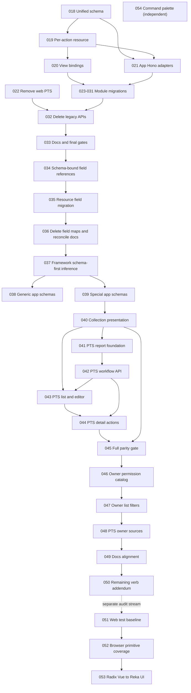

# Implementation Plans

Generated by the Improve skill. Plans 018-039 implemented the current frontend
resource and schema architecture. Plans 040-045 rebuild the approved manual PTS
slice. Plans 046-049 replace PTS-owned create-options with owner lists and
split menu / list / detail / write verbs. Plan 050 applies the same verbs to
the remaining catalog. Execute 046-050 in order. Plan 046 is the catalog
gate; no owner-route or PTS web work starts before it is DONE.
Plans 051-053 audit the shared Vue UI primitive boundary. Execute them in
order: first make the web test baseline deterministic, then add browser
characterization coverage, then migrate the framework primitive imports from
Radix Vue to Reka UI.
Plan 054 adds the first authenticated-shell command palette. It has no
dependency on the primitive audit plans because it consumes the already-migrated
Reka-backed framework dialog and keeps the missing command surface app-local.

## Execution order and status

| Plan | Title | Priority | Effort | Depends on | Status |
|---|---|---|---|---|---|
| 018 | Add unified web resource schema | P1 | M | — | DONE |
| 019 | Replace resource with per-action API | P1 | L | 018 | DONE |
| 020 | Bind Views to action prop bags | P1 | M | 019 | DONE |
| 021 | Add app-owned Hono adapters | P1 | M | 018, 019 | DONE |
| 022 | Remove web PTS module | P1 | S | — | DONE |
| 023 | Migrate basic CRUD cohort | P1 | M | 018-021 | DONE |
| 024 | Migrate read-only cohort | P1 | M | 018-021 | DONE |
| 025 | Migrate transformed CRUD cohort | P1 | L | 018-021; module checkpoints | DONE |
| 026 | Migrate project vendors | P2 | M | projects checkpoint | DONE |
| 027 | Migrate work-items workflow | P2 | L | lookup checkpoints | DONE |
| 028 | Migrate users | P1 | L | roles checkpoint | DONE |
| 029 | Migrate assignment-catalog cohort | P2 | L | permissions, roles, users | DONE |
| 030 | Migrate project-role assignments | P2 | L | users, roles, divisions, projects | DONE |
| 031 | Migrate notifications | P2 | L | 018-021 | DONE |
| 032 | Remove legacy resource APIs | P1 | L | 018-031 and every checkpoint | DONE |
| 033 | Reconcile architecture docs and gates | P2 | M | 032 | DONE |
| 034 | Add schema-bound field references | P1 | M | 018-033 | DONE |
| 035 | Migrate resource actions to field references | P1 | L | 034 | DONE |
| 036 | Remove action field maps and reconcile docs | P1 | M | 034, 035 | DONE |
| 037 | Establish schema-first Zod inference | P1 | M | 036 | DONE |
| 038 | Migrate generic app Zod schemas | P1 | S | 037 | DONE |
| 039 | Migrate special app Zod schemas | P1 | M | 037, 038 edit gate | DONE |
| 040 | Add one-loader collection presentation | P1 | M | — | DONE |
| 041 | Rebuild manual PTS report foundation | P1 | L | 040 | DONE |
| 042 | Implement complete manual PTS workflow API | P1 | L | 041 | DONE |
| 043 | Build manual PTS list and report editor | P1 | L | 040, 041, 042 | DONE |
| 044 | Build manual PTS detail and action screens | P1 | L | 042, 043 | DONE |
| 045 | Verify manual PTS parity and remove draft residue | P1 | M | 040-044 | DONE |
| 046 | Split the PTS owner permission catalog | P1 | M | — | DONE |
| 047 | Add owner list filters and gates | P1 | L | 046 | DONE |
| 048 | Bind PTS forms to owner lists | P1 | M | 047 | DONE |
| 049 | Align docs with owner list sources | P1 | S | 048 | DONE |
| 050 | Apply the remaining permission verb convention | P2 | M | 049 | DONE |
| 051 | Establish a green web-test baseline | P1 | S | — | TODO |
| 052 | Add browser coverage for shared UI primitives | P1 | M | 051 | TODO |
| 053 | Migrate framework primitives from Radix Vue to Reka UI | P1 | M | 051, 052 | TODO |
| 054 | Add route navigation command palette | P1 | M | — | DONE |

Status values: TODO | IN PROGRESS | DONE | BLOCKED (with reason) | REJECTED (with rationale).

## Dependency flow

## Cohort execution rules

- Plan 023 order is flexible, but business categories must finish before divisions, and UOMs plus PTS work categories must finish before work items.
- Plan 024 must finish number variables before number configs. Permissions must finish before role permissions.
- Plan 025 must finish divisions before projects and roles before users.
- Plan 029 is one plan for two similar catalogs, but each module is a separate execution and checkpoint.
- A cohort plan stays IN PROGRESS until all named module checkpoints are complete and reviewed.
- Plan 035 follows the same one-module execution rule and stays IN PROGRESS
  until all 17 field-reference checkpoints are complete.
- Plans 038 and 039 split schema migration by schema behavior. Direct entity
  bindings belong to 038. Local preprocess or transform behavior belongs to
  039. Resource complexity outside the schema does not move a module to 039.
- Plan 040 must finish before any PTS web route is created because the table and
  card grid must share one collection lifecycle.
- Plan 041 starts only after plan 040 is DONE. This keeps the approved framework
  change as the first implementation and review gate. Plan 042 then needs the
  report schema, authorization, numbering, and action executor base from 041.
- Plan 043 needs the final API action contract from 042, not only the report
  CRUD contract from 041.
- Plan 044 extends the route resource and invalidation helper from 043 and must
  not add a client state machine.
- Plan 045 is the final acceptance gate. It may correct confirmed parity defects
  but must stop for any business-rule change.
- Plan 046 must finish before 047 because owner routes cannot compile against
  `list-*` / `detail-*` until those codes exist. One module has one realm:
  `qhsse-pts` becomes system reads; `qhsse-pts-workflow` keeps project writes.
- Plan 047 keeps `/qhsse-pts/create-options` working so the web app does not
  break before 048.
- Plan 048 deletes create-options only after owner lists accept `permission`,
  `rootOnly`, `leafOnly`, and `projectId`.
- Plan 049 updates docs only after 048 has shipped the code.
- Plan 050 is a separate remaining-catalog pass. Do not mix it into 046-049.
- Plan 051 must be DONE before browser characterization starts. It removes a
  known app-test failure without changing production URL fallback behavior.
- Plan 052 must be DONE before plan 053. The browser tests are the migration
  gate for portal, focus, outside-interaction, disclosure, menu, split-button,
  and tab behavior.
- Plan 053 changes only the shared framework primitive dependency and the
  verified Radix-generated selectors and variables. Do not add compatibility
  aliases or migrate unrelated Headless UI code.

## Findings considered and rejected

- One plan per module: rejected because repeated plain CRUD plans add noise without adding implementation safety.
- One execution for a whole cohort: rejected because it creates large diffs and weak verification boundaries.
- A generic transport interface for Hono, services, and fetch: rejected because direct functions already cover non-Hono resources.
- A generic nested-resource or assignment-workflow abstraction: rejected because current modules share syntax, not enough domain behavior.
- Backward-compatibility wrappers: rejected by project policy and the approved design.
- A separate standard raw-form type: rejected because the schema already owns
  raw input and parsed output, and no current resource caller needs a typed raw
  draft.
- One combined app schema migration plan: rejected because `users` and `roles`
  have schema-level input/output behavior that needs a separate verification
  boundary from direct entity bindings.
- One combined PTS implementation plan: rejected because a framework change,
  database migration, transactional workflow, and two web surfaces need separate
  review and rollback boundaries.
- Put the PTS card grid before the framework collection change: rejected because
  it would duplicate loading and query state in application code.
- Add a generic workflow engine: rejected because only PTS needs this state
  machine and one PTS-specific catalog/executor is sufficient.
- Add a generic card-grid component: rejected because there is only one approved
  consumer.
- Keep `/qhsse-pts/create-options` as the long-term source: rejected by the
  owner-list design. Owner `list` / `detail` are the source.
- Add `access-project` or `/me.projectViews`: rejected. Default coverage is any
  active assignment. Menus use system `view-*`.
- One combined owner-list plan: rejected because catalog, API filters, PTS
  binding, and docs need separate review gates.
- Implement the remaining-catalog addendum in the PTS cleanup: rejected because
  it widens the first review without unblocking PTS.
- Add automatic framework invalidation for custom actions: rejected because
  custom actions are plain functions; one local PTS helper supplies the required
  action-then-invalidate sequence.

## Superseded field decision

Plans 019 and 023-033 correctly describe the first per-action migration, but
their complete flat action-field maps caused repeated field behavior. Plan 034
locks the replacement: `defineFields(schema, definitions)`, ordered field
references, and one terminal partial override. Plans 034-036 must ship together,
so the temporary map input in plan 034 never becomes a supported API.
